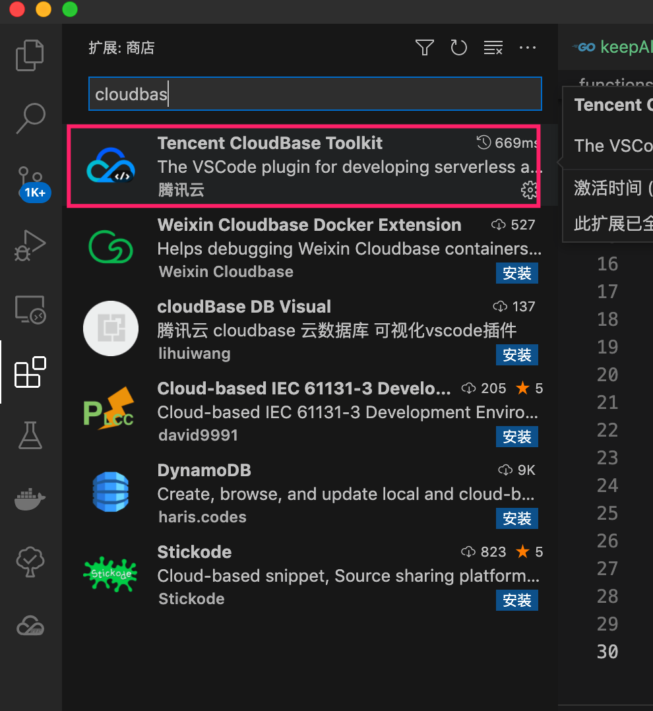
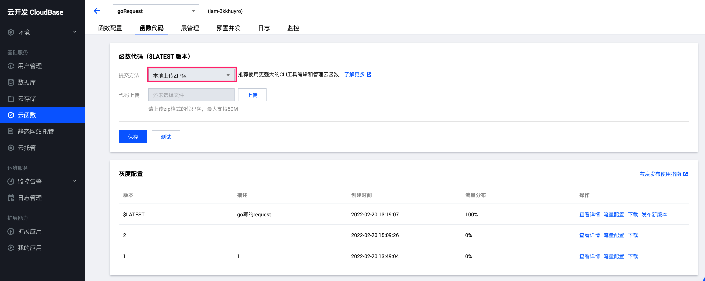
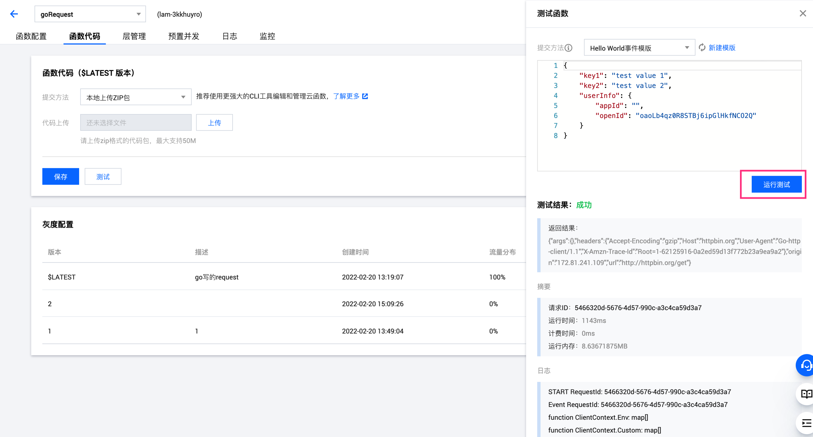
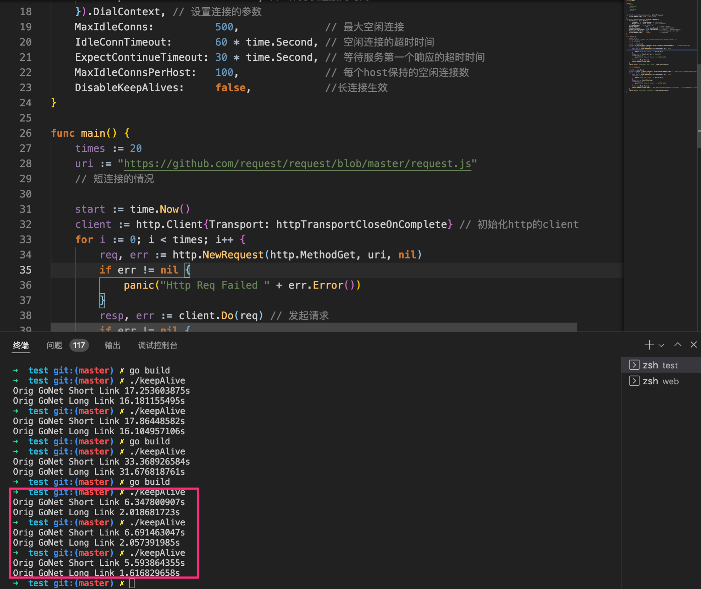

## 参考链接

https://github.com/tencentyun/scf-go-lib


#### 开发说明

推荐安装Tencent CloudBase Toolkit



#### 打包说明

```shell

GOOS=linux GOARCH=amd64 go build -o main main.go

zip main.zip main
```

需要注意，go版本的云函数只能本地编译成可执行文件后在上传zip，而且看起来必须要指定GOARCH以及GOOS。否则云函数是跑步起来的。


#### 部署说明



选择上传


点击保存，就可以测试了；



注意，千万别直接在线上IDE编辑上改代码测试！

就算你试一千遍都不会生效的，很奇怪，既然不支持go在线编辑，那为何不把这个入口干掉呢。

#### 代码示例

```go
package main

import (
	"context"
	"encoding/json"
	"fmt"
	"io/ioutil"
	"net/http"

	"github.com/tencentyun/scf-go-lib/cloudfunction"
	"github.com/tencentyun/scf-go-lib/functioncontext"
)

func hello(ctx context.Context, event interface{}) (interface{}, error) {
	lc, _ := functioncontext.FromContext(ctx)
	fmt.Printf("function ClientContext.Env: %s\n", lc.ClientContext.Env)
	fmt.Printf("function ClientContext.Custom: %s\n", lc.ClientContext.Custom)
	// fmt.Printf("function Environment: %s\n", lc.Environment)
	requestUrl := lc.Environment["APIGateWay_Url"] //这里可以拿到自己设置的环境变量
	secretId := lc.Environment["APIGateWay_SecretId"]
	secretKey := lc.Environment["APIGateWay_SecretKey"]
	fmt.Printf("requestUrl %s\n,secretId %s\n,secretKey %s\n", requestUrl, secretId, secretKey)
	resp, err := http.Get("http://httpbin.org/get")
	if err != nil {
		return err, nil
	}
	defer resp.Body.Close()
	body, _ := ioutil.ReadAll(resp.Body)
	var res interface{}
	json.Unmarshal(body, &res)
	return res, nil
}

func main() {
	// Make the handler available for Remote Procedure Call by Cloud Function
	cloudfunction.Start(hello)
}

```

这里在微信小程序云函数环境中，有点坑，是拿不到请求客户端的clientip的。ClientContext里面打印出来，发现是没有该项的，已经在[开发者社区](https://developers.weixin.qq.com/community/develop/doc/00024e867d86e036d4971353f56400)中提问了。


### 长连接优化

```go
package main

import (
	"fmt"
	"io/ioutil"
	"net"
	"net/http"
	"time"
)

var httpTransportCloseOnComplete = &http.Transport{
	DisableKeepAlives: true, //禁用长连接
}
var httpTransportKeepAlive = &http.Transport{
	DialContext: (&net.Dialer{
		Timeout:   3 * time.Second, // 连接超时时间
		KeepAlive: 7 * time.Second, // 保持长连接的时间
	}).DialContext, // 设置连接的参数
	MaxIdleConns:          500,              // 最大空闲连接
	IdleConnTimeout:       60 * time.Second, // 空闲连接的超时时间
	ExpectContinueTimeout: 30 * time.Second, // 等待服务第一个响应的超时时间
	MaxIdleConnsPerHost:   100,              // 每个host保持的空闲连接数
	DisableKeepAlives:     false,            //长连接生效
}

func main() {
	times := 20
	uri := "https://github.com/request/request/blob/master/request.js"
	// 短连接的情况

	start := time.Now()
	client := http.Client{Transport: httpTransportCloseOnComplete} // 初始化http的client
	for i := 0; i < times; i++ {
		req, err := http.NewRequest(http.MethodGet, uri, nil)
		if err != nil {
			panic("Http Req Failed " + err.Error())
		}
		resp, err := client.Do(req) // 发起请求
		if err != nil {
			panic("Http Request Failed " + err.Error())
		}
		defer resp.Body.Close()
		ioutil.ReadAll(resp.Body)
	}
	fmt.Println("Orig GoNet Short Link", time.Since(start))

	// 长连接的情况

	start2 := time.Now()
	client2 := http.Client{Transport: httpTransportKeepAlive} // 初始化一个带有transport的http的client
	for i := 0; i < times; i++ {
		req, err := http.NewRequest(http.MethodGet, uri, nil)
		if err != nil {
			panic("Http Req Failed " + err.Error())
		}
		resp, err := client2.Do(req)
		if err != nil {
			panic("Http Request Failed " + err.Error())
		}
		defer resp.Body.Close()
		ioutil.ReadAll(resp.Body) // 如果不及时从请求中获取结果，此连接会占用，其他请求服务复用连接
	}
	fmt.Println("Orig GoNet Long Link", time.Since(start2))
}


```



这里使用https://github.com/request/request/blob/master/request.js 测试，使用长连接明显要好过不适用长连接。

这里有一点需要注意，这种特性还需要服务端支持，比如，你遇到这种服务端，那基本上你客户端在怎么努力也行不通

```go
package main

import (
	"log"
	"net/http"
)

func Index(w http.ResponseWriter, r *http.Request) {
	log.Println("receive a request from:", r.RemoteAddr, r.Header)
	w.Write([]byte("ok"))
}

func main() {
	var s = http.Server{
		Addr:    ":8080",
		Handler: http.HandlerFunc(Index),
	}
	s.SetKeepAlivesEnabled(false)//服务度直接给你关闭
	s.ListenAndServe()
}
```


各种测试长连接的参考链接在[这里](https://github.com/bigwhite/experiments/tree/master/http-keep-alive)

