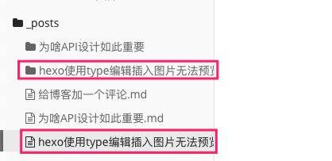
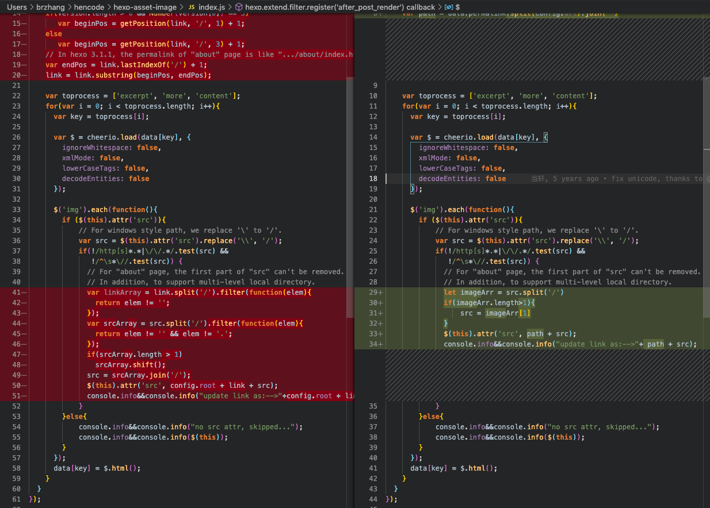
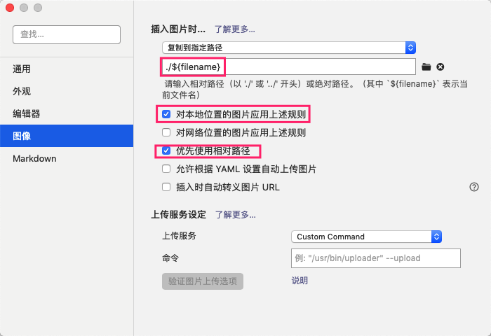

事情是这个样子的，今天准备开个自己的博客，如是研究了下，使用 hexo 在 github 上发布博客是一个号的选择。

hexo 可以参考这里 https://hexo.io/zh-cn/
typora 可以参考这里 https://typora.io/


这两个哥们搭配，干活就珍惜不累了，安装hexo和安装typora的工作暂且就不在这里唠叨了，随便Google一下，相信你很快就可以安装上了。

然后，这篇文章主要想说的是，在配置typora插图的过程中，遇到了一个坑，我是这么按照hexo的教程配置的：

https://hexo.io/zh-cn/docs/asset-folders 

```javascript
_config.yml
post_asset_folder: true
```


据说，当资源文件管理功能打开后，Hexo将会在你每一次通过 `hexo new [layout] <title>` 命令创建新文章时自动创建一个文件夹。



对的，没错，老铁，就是上面这个样子，一顿操作猛如虎，结果

```javascript
hexo g
hexo d //部署到github上显示不了
hexo server //本地预览显示不了
```

看了一下，图片压根就显示不出来，看了下，明显图片路径有问题。

后面看到一个哥们的文章，[hexo使用markdown图片无法显示问题_jhhuang-程序员宅基地](https://cxyzjd.com/article/huyun9666/104256799)然后install他的插件之后，发现部署到github上确实可以显示，but，本地没法预览呀，这个有点上火，看了下源码，就自己果断撸了一个；



一通操作猛如虎，其实就改了这么几行，把作者之前的替换的路径

//yousite/path/to/your/image.jgp  修改为了  /path/to/your/image.jgp

需要的老铁可以直接使用我[这个补丁](https://github.com/bravekingzhang/hexo-asset-image)就ok啦 ，用法已经在readme中有详细介绍了。


#### 最后附上我的所有关键配置

##### hexo的配置

```javascript
# Hexo Configuration
## Docs: https://hexo.io/docs/configuration.html
## Source: https://github.com/hexojs/hexo/

# Site
title: 心随我动
subtitle:
description:
author: hz
language: zh-CN
timezone: Asia/Shanghai

# URL
## If your site is put in a subdirectory, set url as 'http://yoursite.com/child' and root as '/child/'
url: https://blog.brzhang.club
root: /
permalink: :year/:month/:day/:title/
permalink_defaults:

# Directory
source_dir: source
public_dir: public
tag_dir: tags
archive_dir: archives
category_dir: categories
code_dir: downloads/code
i18n_dir: :lang
skip_render:

# Writing
new_post_name: :title.md # File name of new posts
default_layout: post
titlecase: false # Transform title into titlecase
external_link: true # Open external links in new tab
filename_case: 0
render_drafts: false
post_asset_folder: true
marked:
  prependRoot: false
  postAsset: true
  lazyload: true
relative_link: true
future: true
highlight:
  enable: true
  line_number: true
  auto_detect: false
  tab_replace:

# Home page setting
# path: Root path for your blogs index page. (default = '')
# per_page: Posts displayed per page. (0 = disable pagination)
# order_by: Posts order. (Order by date descending by default)
index_generator:
  path: ""
  per_page: 10
  order_by: -date

# Category & Tag
default_category: uncategorized
category_map:
tag_map:

# Date / Time format
## Hexo uses Moment.js to parse and display date
## You can customize the date format as defined in
## http://momentjs.com/docs/#/displaying/format/
date_format: YYYY-MM-DD
time_format: HH:mm:ss

# Pagination
## Set per_page to 0 to disable pagination
per_page: 10
pagination_dir: page

# Extensions
## Plugins: https://hexo.io/plugins/
## Themes: https://hexo.io/themes/

tag_generator:
  per_page: 10
  order_by: -date

theme: ocean

# Deployment
## Docs: https://hexo.io/docs/deployment.html
deploy:
  type: git
  repository: https://github.com/bravekingzhang/bravekingzhang.github.io.git
  brance: master

```

typora的图片上传配置




