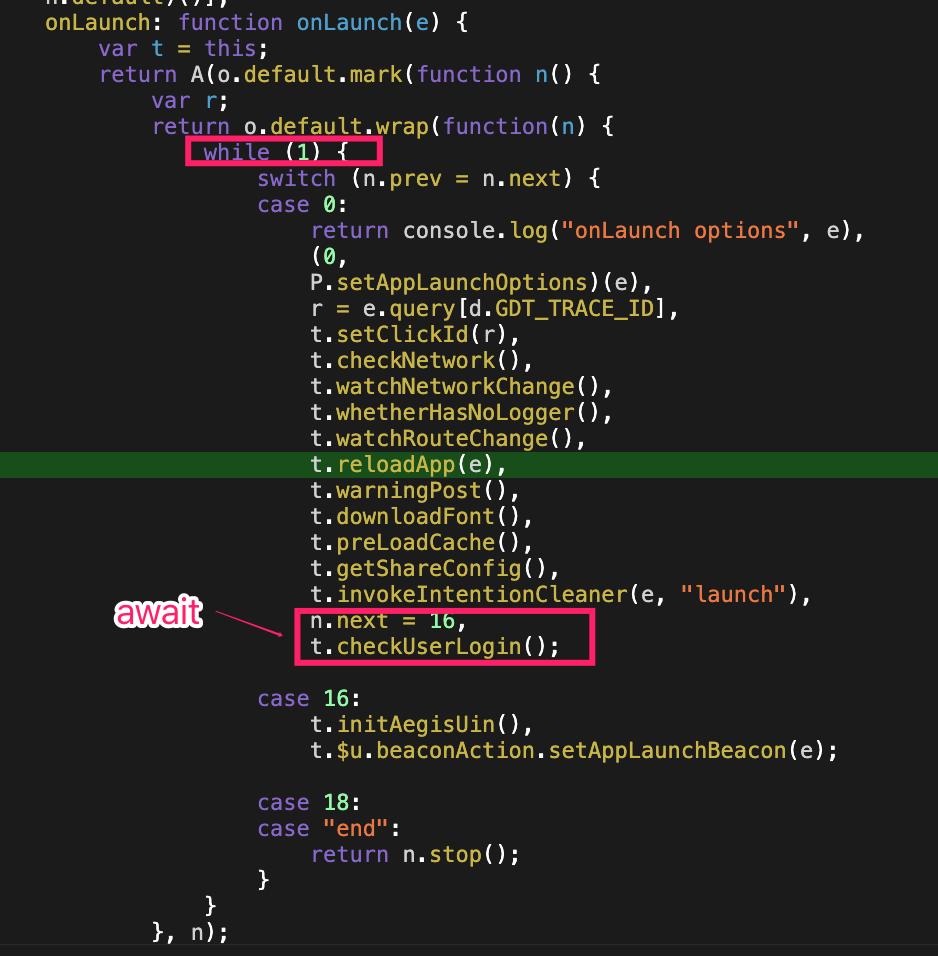

```javascript
async onLaunch(options) {
    console.log('onLaunch options', options);
    // 设置冷启动参数
    setAppLaunchOptions(options);
    // 广告回传
    const { query: { [GDT_TRACE_ID]: clickId } } = options;

    // 广告id
    this.setClickId(clickId);

    // 监听网络变化
    this.checkNetwork();
    this.watchNetworkChange();

    // 无法日志上报统计
    this.whetherHasNoLogger();

    // 路由变化监听
    this.watchRouteChange();

    // 初始化启动的流程
    this.reloadApp(options);
    // 告警
    this.warningPost();

    // 调用字体
    this.downloadFont();

    // 预加载缓存数据
    this.preLoadCache();

    // 查分享数据
    this.getShareConfig();
    this.invokeIntentionCleaner(options, 'launch');
    // 检查登录态
    await this.checkUserLogin();
    // 设置 aegis uin
    this.initAegisUin();

    // 增加公参和冷启动埋点
    this.$u.beaconAction.setAppLaunchBeacon(options);
  },

```

转换之后的代码



可以看到 async await使用了while(true)的循环转换了代码，保证，await的方法执行完成之后在执行后续的方法。

那如果是 await promise呢 ，那肯定是while到强制等到 resolve了。要么是 catch了。

