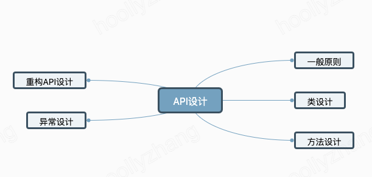

#### 为什么 API 设计很重要？

- API 可以是一个公司最重要的资产之一【**客户投入大量资金：购买、编写、学习**
  **停止使用 API 的成本可能很高，成功的公共 API 可以捕获客户**】
- 也可能是公司最大的负债之一 【**不好的 API 会导致无休止的支持电话流**】
- 公共 API 是永久性的【**只有一次机会可以做好它**】

#### 为什么 API 设计对你很重要？

如果你编程，你就是一个 API 设计师，好的代码是模块化的--每个模块都有一个 API

- 有用的模块往往会被重复使用
  一旦模块有了用户，就不能随意改变 API \_好的可重复使用的模块是企业资产
- 从 API 的角度思考问题可以提高代码质量

#### 好的 API 的特点

- 易于学习
- 易于使用，即使没有文档
- 难以误用
- 易于阅读和维护使用它的代码 - 足够强大以满足需求 - 易于扩展
- 适合受众

#### 好的API是如何设计出来的

一般来说，好的API需要遵循一下几大类设计



##### 收集需求--带着一定程度的怀疑态度

- 通常你会得到建议的解决方案 _ 可能存在更好的解决方案
- 你的工作是提取真正的需求 _ 应该采取用例的形式
- 建立一个更普遍的东西可能更容易，也更有意义。

##### 一切从简

- 在这个阶段，敏捷性胜过完整性
- 尽可能让更多的人了解规格，听取他们的意见并认真对待
- 如果你保持简短的规格，就很容易修改。
- 当你获得信心时，就可以使其更加完善_这必然涉及到编码问题

##### API应该只做一件事，而且要做得极致

- 功能应该容易解释
如果它很难被命名，这通常是个坏兆头 _ 好的名字能推动开发
_ 要便于拆分和合并模块

##### 尽量自闭环

- 尽可能地使类和成员成为私有的
- 公有类应该没有公有字段
(常量除外)
- 这样可以最大限度地隐藏信息
- 允许模块被独立使用、理解、构建、测试和调试

##### 名字很重要--名称应该基本上是不言自明的 _ 避免使用隐晦的缩略语

- 要一致--相同的词意味着相同的事情 _ 在整个API中，（在平台的各个API中）。

- 要有规律--力求对称--代码应该像散文一样阅读

  ```javascript
  if (car.speed() > 2 * SPEED_LIMIT) 
    generateAlert("Watch out for cops!");
  ```


##### 总体来说，API设计是一项高尚而有意义的工作，它可以改善程序员、终端用户、公司的命运。

- 这个讲座涵盖了这门手艺的一些启发式方法 _ 不要一味地遵守它们，但是......
不要在没有充分理由的情况下违反它们
- API设计是艰难的
-不是一个单独的活动
-完美是不可能的，但还是要努力。