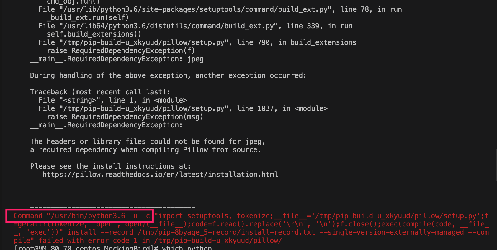
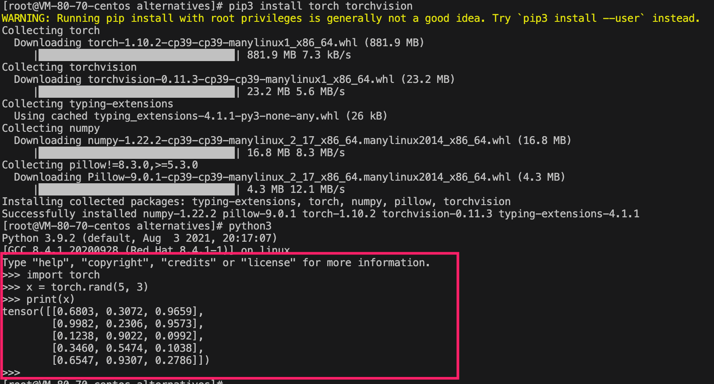
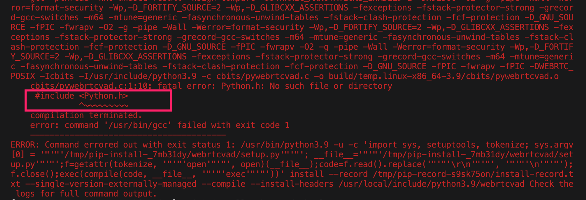
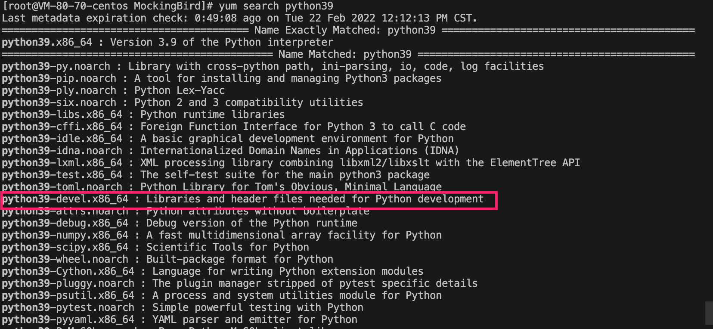
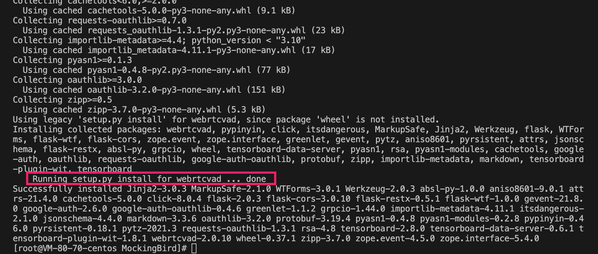
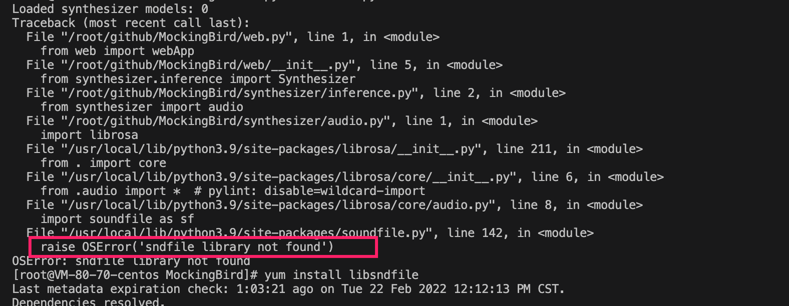
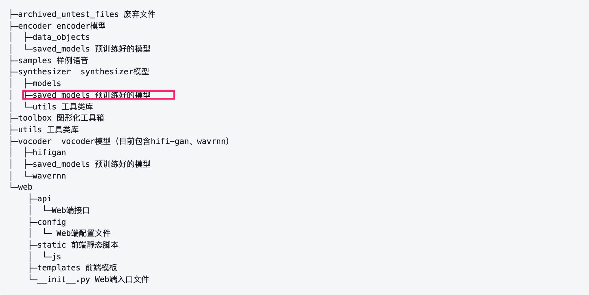
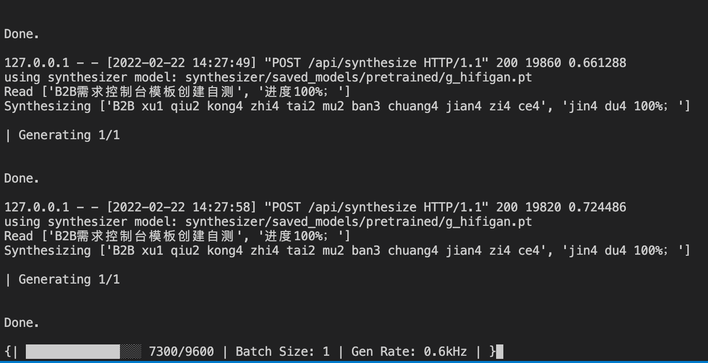

### 项目地址

https://github.com/babysor/MockingBird

git clone项目到本地，然后安装环境，开始体验。

### 操作方式

#### 1、环境安装

##### 1、1安装python环境

```shell
yum install python39
```

##### 1、2指定系统默认python版本

```shell
[root@VM-80-70-centos alternatives]# update-alternatives --config python3

There are 3 programs which provide 'python3'.

  Selection    Command
-----------------------------------------------
   1           /usr/bin/python3.8
*  2           /usr/bin/python3.6
 + 3           /usr/bin/python3.9

Enter to keep the current selection[+], or type selection number: 

```

这里默认是3.6，这个工程是不支持的，比如后续如果安装pytorch，就会报错




所以，这里输入3，选择3.9版本搞起，其实也可以系统python版本如果高于3.7也是可以不用安装python3.9，可直接进入安装pytorch。

##### 1、3安装pytorch

```shell
pip3 install torch torchvision
```

验证一下是否安装成功

```python
import torch
x = torch.rand(5, 3)
print(x)
#=============输出
```



##### 1、4安装ffmpeg，这个比较复杂，最好是使用源码编译安装的方式，yum找源大概率报错

安装以及升级可以参考这里的步骤  https://trac.ffmpeg.org/wiki/CompilationGuide/Centos，整个过程网络ok的情况下至少需要半小时。

我这里只展示安装的步骤，升级可以通过上面的链接查找。

step1

```shell
yum install autoconf automake bzip2 bzip2-devel cmake freetype-devel gcc gcc-c++ git libtool make pkgconfig zlib-devel
```

step2

```shell
mkdir ~/ffmpeg_sources
```

step3

```shell
cd ~/ffmpeg_sources
curl -O -L https://www.nasm.us/pub/nasm/releasebuilds/2.15.05/nasm-2.15.05.tar.bz2
tar xjvf nasm-2.15.05.tar.bz2
cd nasm-2.15.05
./autogen.sh
./configure --prefix="$HOME/ffmpeg_build" --bindir="$HOME/bin"
make
make install
```

step4

```shell
cd ~/ffmpeg_sources
curl -O -L https://www.tortall.net/projects/yasm/releases/yasm-1.3.0.tar.gz
tar xzvf yasm-1.3.0.tar.gz
cd yasm-1.3.0
./configure --prefix="$HOME/ffmpeg_build" --bindir="$HOME/bin"
make
make install
```

step5

```shell
cd ~/ffmpeg_sources
git clone --branch stable --depth 1 https://code.videolan.org/videolan/x264.git
cd x264
PKG_CONFIG_PATH="$HOME/ffmpeg_build/lib/pkgconfig" ./configure --prefix="$HOME/ffmpeg_build" --bindir="$HOME/bin" --enable-static
make
make install
```

step6

```shell
cd ~/ffmpeg_sources
git clone --branch stable --depth 2 https://bitbucket.org/multicoreware/x265_git
cd ~/ffmpeg_sources/x265_git/build/linux
cmake -G "Unix Makefiles" -DCMAKE_INSTALL_PREFIX="$HOME/ffmpeg_build" -DENABLE_SHARED:bool=off ../../source
make
make install
```

step7

```shell
cd ~/ffmpeg_sources
git clone --depth 1 https://github.com/mstorsjo/fdk-aac
cd fdk-aac
autoreconf -fiv
./configure --prefix="$HOME/ffmpeg_build" --disable-shared
make
make install
```

step8

```shell
cd ~/ffmpeg_sources
curl -O -L https://downloads.sourceforge.net/project/lame/lame/3.100/lame-3.100.tar.gz
tar xzvf lame-3.100.tar.gz
cd lame-3.100
./configure --prefix="$HOME/ffmpeg_build" --bindir="$HOME/bin" --disable-shared --enable-nasm
make
make install
```

step9

```shell
cd ~/ffmpeg_sources
curl -O -L https://archive.mozilla.org/pub/opus/opus-1.3.1.tar.gz
tar xzvf opus-1.3.1.tar.gz
cd opus-1.3.1
./configure --prefix="$HOME/ffmpeg_build" --disable-shared
make
make install
```

step10

```shell
cd ~/ffmpeg_sources
git clone --depth 1 https://chromium.googlesource.com/webm/libvpx.git
cd libvpx
./configure --prefix="$HOME/ffmpeg_build" --disable-examples --disable-unit-tests --enable-vp9-highbitdepth --as=yasm
make
make install
```

step11

```shell
cd ~/ffmpeg_sources
curl -O -L https://ffmpeg.org/releases/ffmpeg-5.0.tar.bz2
tar xjvf ffmpeg-5.0.tar.bz2
cd ffmpeg-5.0
PATH="$HOME/bin:$PATH" PKG_CONFIG_PATH="$HOME/ffmpeg_build/lib/pkgconfig" ./configure \
  --prefix="$HOME/ffmpeg_build" \
  --pkg-config-flags="--static" \
  --extra-cflags="-I$HOME/ffmpeg_build/include" \
  --extra-ldflags="-L$HOME/ffmpeg_build/lib" \
  --extra-libs=-lpthread \
  --extra-libs=-lm \
  --bindir="$HOME/bin" \
  --enable-gpl \
  --enable-libfdk_aac \
  --enable-libfreetype \
  --enable-libmp3lame \
  --enable-libopus \
  --enable-libvpx \
  --enable-libx264 \
  --enable-libx265 \
  --enable-nonfree
make
make install
hash -d ffmpeg
```

##### 1、5安装python需要的包

```sh
cd /pathto/MockingBird #到里本地项目克隆路径下
pip3 install -r requirements.txt
```

什么鬼，安装直接报错



查了下资料，要解决这个问题，需要暗转下python39的devel，于是

```shell
# 安装EPEL源
yum install epel-release -y
# 安装python3开发包
yum install python39-devel -y
```



这里大概就有我们需要的头文件了，然后在重试一次



这一次果断就成功了。

##### 继续安装一个可选的依赖

```shell
pip3 install webrtcvad-wheels
```


至此，整个环境的安装才算完毕，我初步估算了下，大概需要45分钟左右部署好环境。


#### 2、准备模型

这里我直接使用社区准备好的模型

| 作者 | https://pan.baidu.com/s/1iONvRxmkI-t1nHqxKytY3g [百度盘链接](https://pan.baidu.com/s/1iONvRxmkI-t1nHqxKytY3g) 4j5d |      | 75k steps 用3个开源数据集混合训练 |
| ---- | ------------------------------------------------------------ | ---- | --------------------------------- |
|      |                                                              |      |                                   |

#### 3、打开web网页

```python
python web.py 
```

什么鬼，又一个报错



查了下，需要安装

```shell
yum install libsndfile
```


 运行成功后在浏览器打开地址,默认为 http://localhost:8080


这就表示已经玩起来了。

注意，开始synthesizer是没有模型的，需要自己把第二步下载好的模型复制到



这个目录下。

#### 4、玩法


