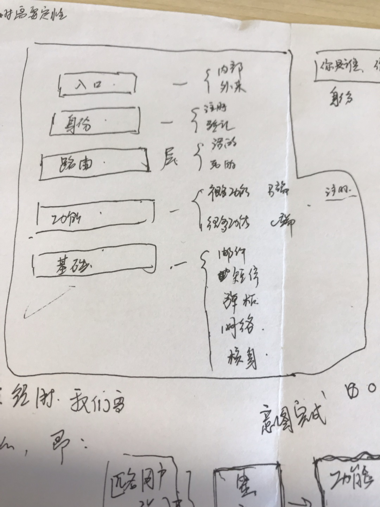
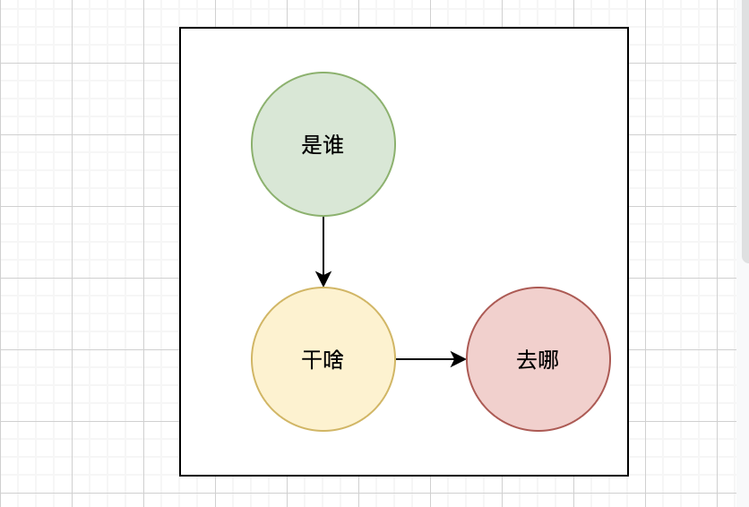
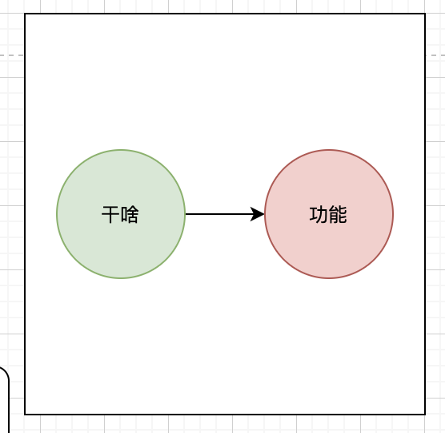
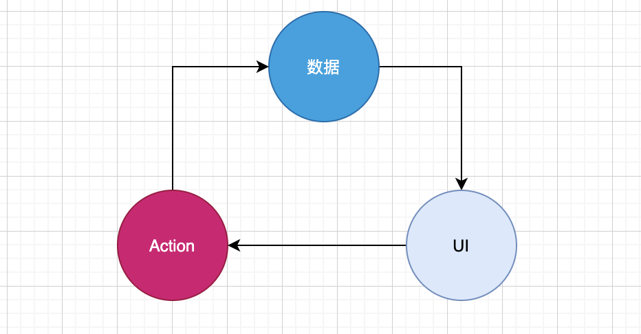
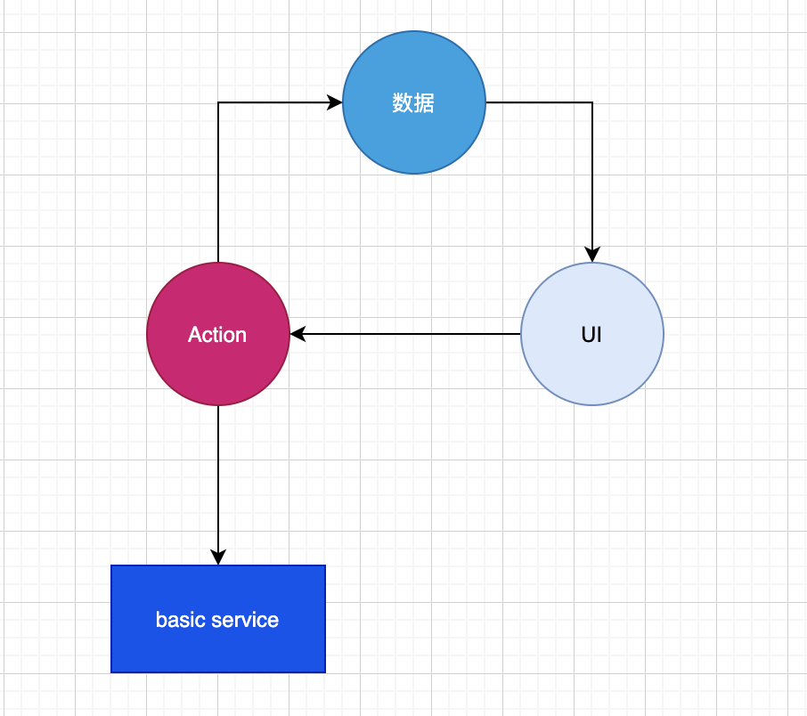
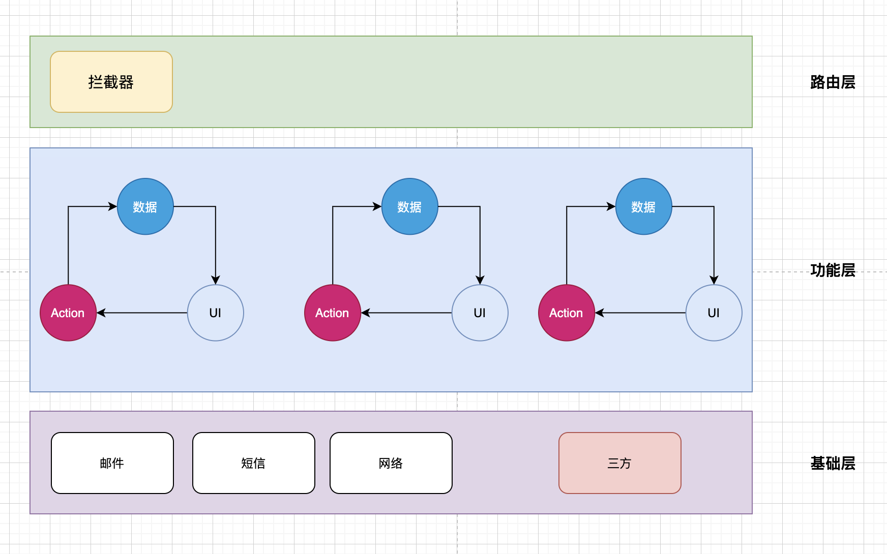

#### 背景

首先，关于这篇文章为何取名为设计一个**糅合系统**的设计，所谓的糅合系统，是指这个系统的用户群体没有那么纯粹，比如，是一个既有c端用户，又有b端用户的使用场景的系统，起初在设计这样一个系统之初，我思考过这样的一个系统会有几个问题：

- 逻辑混杂，到时候会出现这个c端是这个样子的，b端为了兼容而妥协，折中出来的并不是一个好的方案，对两类用户来说都**不够简洁**。
- if/else糅合的代码可理解性比较差，随着迭代的推进，后续会越来越来维护。
- b端更加注重功能体验，他们要的是功能能不能满足他日常运营，而且**不同类的b其功能是不同的**，用户端更加注重操作体验体验是否好，当然b端也注重操作体验，但相对没c端这么匠心。
- 不同的b端可能需要的主体风格不同，是考虑一个b一套代码，还是一套代码配置不同的b，还是一套b的框架下组合不同的工具。
- 分离/b-part/c-part之后，如何复用公共逻辑，减少重复开发工作，公共逻辑包括哪些，下层的规则是什么，该放在何处。
- 假如让一个新手加入进来，他怎么快速找到相应的业务的代码逻辑在何处，如何新增，修改代码已实现需求。

基于以上这些点的思考，我首先走出了一个设计的雏形。

#### 孵化

首先，我们先站在上帝视角来看一看，一个用户是如何和我们的系统打交道的。第一个我们关心的是一个三要素：

**是谁？来干什么？干什么后去哪里？**我们可以用一个故事的方式来描述几个这样的案例。

1. 我是巴乐兔的合同管理员，我来这里给张三发起一份合同，完事之后我要回公司报备下。
2. 我是李子柒，朋友说这个挺好用的我就来了，我也不知道干什么，我更不知道我要去哪。
3. 我是黎明，是一个学生，我来签一份摩尔公司发给我的暑期实习劳务合同，完事之后我就没事啦。
4. 我是韩梅梅，是旺旺兴趣培训班的店员，我来签一份佳佳食品发给我们培训班的采购服务合同。
5. ....

以上的场景，我们均可以从里面抛出【是谁，干啥，去哪】，这其实就是我要说的**意图2.0**，。

故事2是一个特例，实际上，不知道什么干什么也是一种干什么，不知道去哪也是一种去哪，不知道是谁也是一种是谁。

##### 是谁

就是要确定进入系统的用户身份，是b端的用户，还是c端的用户，一旦确定了身份，这个应该是**全局可知**的

- isC
- isB

##### 干啥

就是要确定是谁之后的事了，就像大家去政府办事一样，人家首先明确你是谁，然后在问你来干啥，你干啥是不是得交出一些办事的凭据来，事情的id，**通过这个事情的id就对应到了不同的功能**。

##### 去哪

首先每个功能有其内部的流转流程，它自己知道哪一步该去哪？但是：

- 他这个内部的流程结束了呢？
- 遇到异常了呢？

那么他下一步将走到哪里呢？这个是这个故事里的人的是，应该把选择的权利交给他。

#### 实施

##### 如何确定用户身份

要确定用户身份，我设计需要一个**用户管理**模块，它具备的能力有：

- 切换身份，满足一部分用户既是b端用户也是c端用户的场景。
- 申请身份
- 登录角色

最终是为了确定用户身份。

##### 如何确定用户来干什么

我们去银行我们会带上银行卡，我们去买菜会带上菜篮子，我们去做火车会带着车票，我们去考试会带上准考证....我们都会遵守一些既定的事情的协议。

- xx:bank
- xx:buy
- xx:train
- xx:exam

我们去买什么东西会写一个清单，如是：

- xx:buy&item1="南瓜1斤"&item2="瓜子1公斤"

所以，用户来干什么，都是一系列的动作，做这些动作需要一个清单才知道具体怎么做，**交给谁做很容易，我们就想到了路由**。

路由器就是一个配置表，表述的事情是，xx:buy&item1="南瓜"&item2="瓜子1公斤"

|          | 功能      | 参数                              | realPath          |
| -------- | --------- | --------------------------------- | ----------------- |
| xx:c-buy | c端买东西 | item1="南瓜1斤"&item2="瓜子1公斤" | pages/c-buy/index |
| xx:b-buy | b端买东西 | item3="南瓜1斤"&item4="瓜子1公斤" | pages/b-buy/index |
|          |           |                                   |                   |

##### 功能是什么？

**功能需要是一个比较内聚的概念**，他可以包含一系列的动作，有自己内部的流转流程，更具数据的状态及用户的操作来驱动页面UI 的展示，即：

> 功能= 数据 + action + UI

功能，他有依赖底层的一些服务，及一些公共的工具函数。

那么，基础服务包括哪些呢？

- 网络服务
- 邮件服务
- 短信服务
- 甚至是三方服务，如人脸核身

##### 整体的三层架构

经过上面的分析，我们不能达成一个从上倒下依赖的三层架构模式：

- 路由层
- 功能层
- 基础层

> 路由层的作用是找到三要素【是谁，干啥，完事之后去哪】

**拦截器**是干啥的，上面已经提到，是找出三要素，找到之后如果发现非法入侵，就会把他路由到非法页。

> 功能层是解决干啥的。

功能才的Action是干啥的，是处理用户的的各种动作的，包含：

- 网络请求
- 本地请求

这样的一些操作都的会引起数据变化，进而导致UI发生改变。UI的实现可以原生，可以web，

> 基础层是帮助功能层很好的完成干啥的。

#### 还缺点啥？

一个好的系统肯定是需要可观测性的，需要trace用户的行为，包含

- 进入哪个页面
- 做了哪些动作
- 动作的前因，后果是啥

