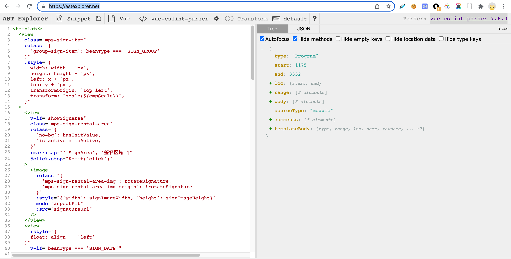
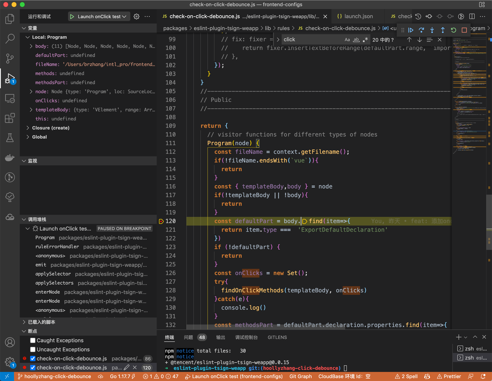
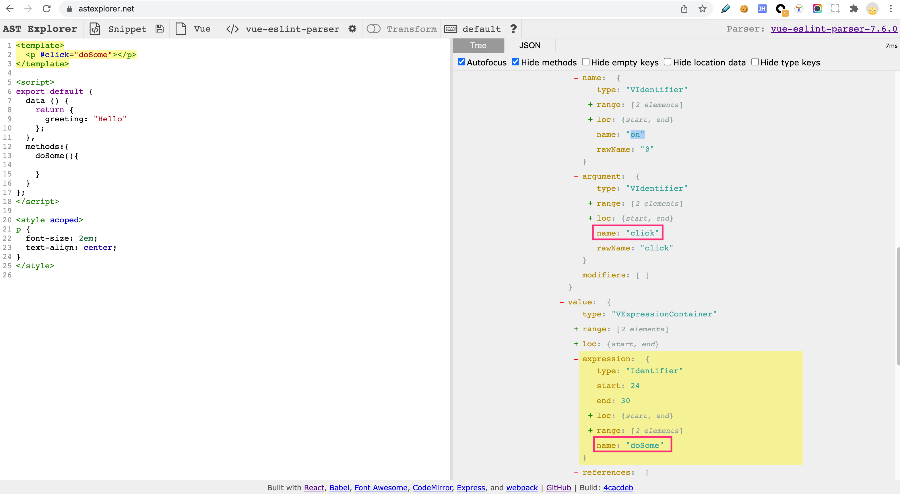
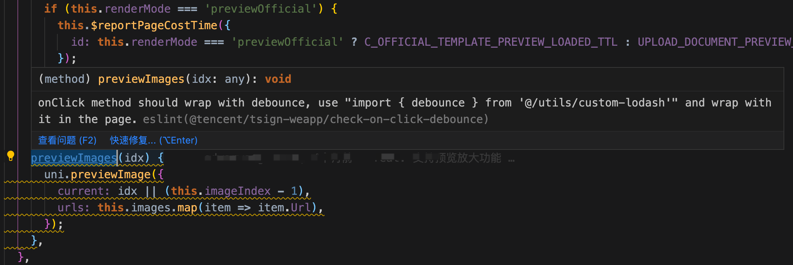

#### 背景

从**腾讯电子签**在现网问题反馈中，我们发现中发现有部分用户吐槽一些按钮不小心快速多次点击出现出现多个类似的页面，处理完业务之后回退需要退两次。虽说对于业务流程来说没有影响，但是确实影响到用户体验，所以如何优雅且**强制性**规范的在小程序上做防重复点击是本文研究的重点。

#### 分析

腾讯电子签小程序基于 uni-app 研发，举个栗子，通常一处存在点击的处理事件长这个样子，见下面的@click。

```vue
<template>
  <PdfItem v-for="(img, idx) in images" @click="doSomeThing(idx)" />
</template>
<script>

export default {

  data() {
    return {
      ...
    };
  },
  methods: {
    doSomeThing(idx) {
      //do some thing
    },
  },
};
</script>
```

那么，如何做好并消灭防重复点击就是本文要研究的点。拿上面的例子来说，大概有几个方式

1. 在 doSomeThing 中加一个变量，当做门卫，如果方法没处理完，再次进入直接返回，恩，每个方法都需要增加一段逻辑，去设置变量，比较繁琐。

   1. ```javascript
      doSomeThing(){
        if(isDoing){
          return
        }
        isDoing = true
        ....
        isDoing = false
      }
      ```

2. 给 doSomeThing 方法增加一个 debounce 包裹一下，恩，比第一种略好，更加简洁点。

   1. ```javascript
      doSomeThing:_.debounce(function(){
        ....
      })
      ```

3. hook 的方式 hook 住 click 方法，然后来做处理逻辑，无奈小程序也没有类似 web 的这种 addEventListener，遂放弃。

找到一种好的解决方式不是难问题，难问题是：

1. 我们的业务代码中，已经出现了很多出没有增加防抖逻辑包裹的代码，难道线上遇到一个反馈，解决一个吗？
2. 如何限制后续编码过程中，大家写 onclick 代码的时候，强制加上 onclick。

很显然，对于代码规范检测，我们非常容易想到使用 eslint，但是现有的 eslint 有这么规则吗？自然是没有的，所以，我们遇到的问题在理论上转换为了：**如何开发一款插件有效的检测 onClick 有没有使用防抖**。

#### eslint 插件开搞

##### 基本开发准备

插件开发的整体流程我就不在本文的介绍当中，本文只关心如何去实现检测的逻辑及基本的程序入口和调试技巧介绍。首先，我们要检测的文件是 .vue 文件，因此，我们需要在 eslint 大环境下解析 vue 语法，那么使用什么方式解析 vue 语法，我们需要自己开发吗，显然不是，vue 肯定是有的，比如[vue-eslint-parser](https://github.com/vuejs/vue-eslint-parser#readme),想要更加直观的看解析效果，可以到[astexplorer](https://astexplorer.net/)贴上一段 vue 代码看看。



那么，我们就可以插件的开发框架下，模拟 vue 文件被这个插件解析，然后生成一个语法树抛给 eslint 插件入口，参见下面的代码块，解析好的语法数会已 node 参数传入到 Program 函数。

```javascript
/**
 * @fileoverview onClick should wrap with debounce in page
 * @author hoollyzhang
 */
'use strict';

//------------------------------------------------------------------------------
// Rule Definition
//------------------------------------------------------------------------------
console.log('电子签防抖插件已加载')
/**
 * @type {import('eslint').Rule.RuleModule}
 */
module.exports = {
  meta: {
    type: 'problem', // `problem`, `suggestion`, or `layout`
    docs: {
      description: 'onClick should wrap with debounce in page',
      category: 'Possible Problems',
      recommended: true,
      url: null, // URL to the documentation page for this rule
    },
    schema: [], // Add a schema if the rule has options
    messages: {
      missingAddDebounceClick: `onClick method should wrap with debounce, use "import { debounce } from '@/utils/custom-lodash'" and wrap with it in the page.`,
      shouldNotUseEmitThisWay: `It is suggested to use the debounce method of wrapping`
    }
  },

  create(context) {
    // variables should be defined here

    //----------------------------------------------------------------------
    // Helpers
    //----------------------------------------------------------------------

    //----------------------------------------------------------------------
    // Public
    //----------------------------------------------------------------------

    return {
      // visitor functions for different types of nodes
      Program(node) {
        const fileName = context.getFilename();
        if(!fileName.endsWith(`vue`)){
          return
        }
        //...
        const { templateBody,body } = node

        [...methods].map(item=>reportError(item))
      },
    };
  },
};

```

插件开发框架为了便于我们开发调试插件，提供了这样一套模板方法

```javascript
/**
 * @fileoverview Import subPackage config in page
 * @author hoollyzhang
 */
"use strict";

//------------------------------------------------------------------------------
// Requirements
//------------------------------------------------------------------------------

const rule = require("../../../lib/rules/check-on-click-debounce");
const VUE_ESLINT_PARSER = path.join(
  __dirname,
  NODE_MODULES,
  "vue-eslint-parser"
);

//------------------------------------------------------------------------------
// Tests
//------------------------------------------------------------------------------

const ruleTester = new RuleTester();
ruleTester.run("check-on-click-debounce", rule, {
  valid: ["pages/vue-onclick-debounce/onclick-debounce-test-ok.vue"].map(
    (filename) => ({
      code: fs.readFileSync(path.join(TEST_INPUTS_DIR, filename), "utf8"),
      filename: path.join(TEST_INPUTS_DIR, filename),
      parser: VUE_ESLINT_PARSER,
      parserOptions,
    })
  ),

  invalid: ["pages/vue-onclick-debounce/onclick-debounce-test-not-ok.vue"].map(
    (filename) => ({
      code: fs.readFileSync(path.join(TEST_INPUTS_DIR, filename), "utf8"),
      filename: path.join(TEST_INPUTS_DIR, filename),
      parser: VUE_ESLINT_PARSER,
      parserOptions,
      errors: [{ messageId: "missingAddDebounceClick" }],
    })
  ),
});
```

所以，我们可以使用这个验证我们研发的 eslint 插件是否符合预期，而且调试起来也比较方便，在 vscode 上开发的话，配置一个启动项即可，比如我配置了一个 launch.json;

```json
{
  // 使用 IntelliSense 了解相关属性。
  // 悬停以查看现有属性的描述。
  // 欲了解更多信息，请访问: https://go.microsoft.com/fwlink/?linkid=830387
  "version": "0.2.0",
  "configurations": [
    {
      "type": "pwa-node",
      "request": "launch",
      "name": "Launch onClick test",
      "skipFiles": ["<node_internals>/**"],
      "program": "${workspaceFolder}/packages/eslint-plugin-tsign-weapp/tests/lib/rules/check-on-click-debounce.js"
    }
  ]
}
```

这样一来，我们就可以展开调试了。



##### 检测原理介绍

1、首先我们需要拿到所有<template 中被 @click 引用到的方法，这个可以通过递归遍历 templateBody 这个树解决。



如上图，我们只需要找到这个 argument name 是 click 的这个结点中 value 里面的 expression 的 name，就是我们要检测的方法

2、基于上面找到的方法，我们在去 methods 的结点中去找到对应的方法，看看这个方法的 body 有没有被 debounce 包裹即可，如果没有哦就告警处理。

##### 实际效果


