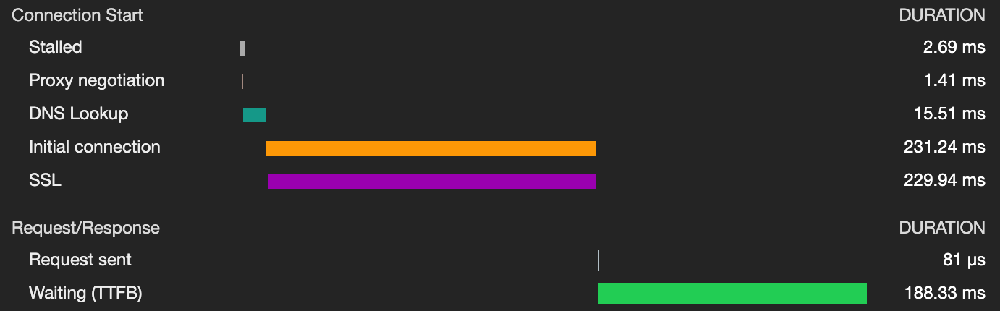
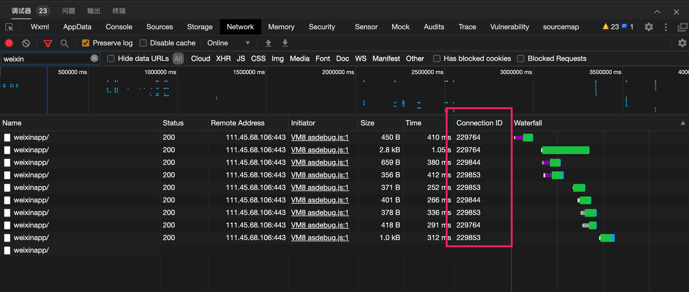
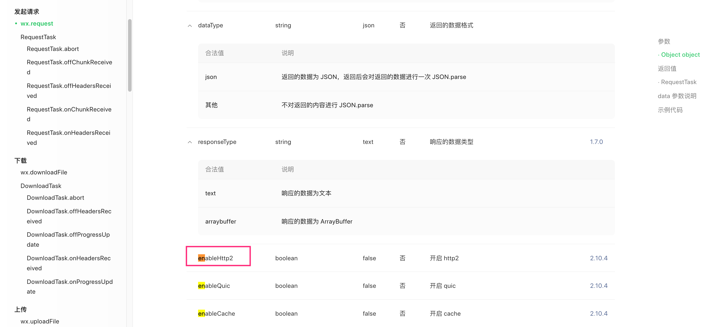
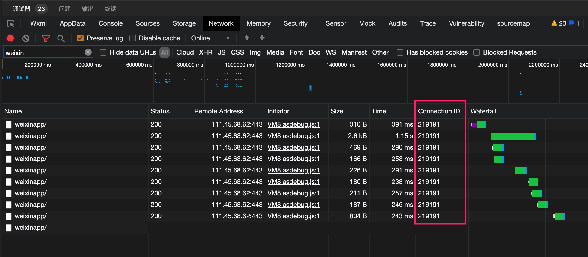
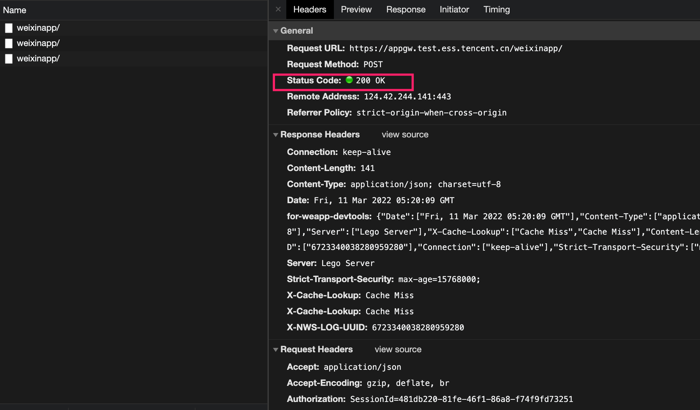
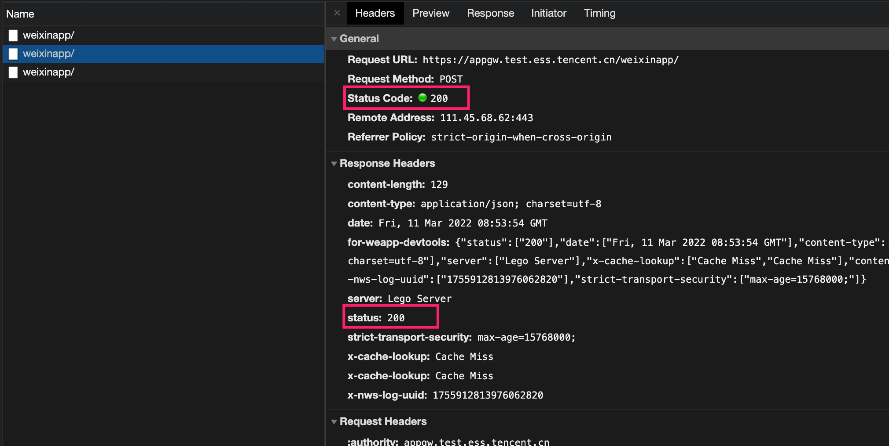

#### http2.0

但是有请求还是在建立连接，不知道为啥

问了一下google，发现是小程序默认没有开启http2。

然后搜索了一下社区，发现需要手动开启

所以，把这个选型开启之后，看一看效果

首屏除第一个请求之后，其他请求都是没超过400ms的，而且可以看到ConnectionID确实是复用的。

另外发现最后一个请求没的状态码没给出来，但是看下详情

是 `200 OK`，对比一下正常展示的请求

发现有点不大一样，正常的请求状态码这里展示 `200`，而且Response Headers中有明确的status这个字段。之类怀疑是小程序的开发者工具实现有点粗糙了，兼容性不好。

#### 列表页一个tab下拉出现2个请

DescribeBatchSignFlowList

DescribeFlows

#### 很多地方都会发生的请求

CheckUserAgreementVersion