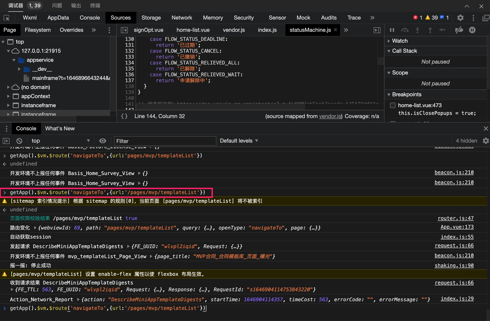

##### 1、在命令行直接进入任何一个页面



好处，可以灵活构造各种参数进入页面进行开发，缺点不支持scene参数传入。

```javascript
getApp().$vm.$route('navigateTo', { url: '/pages/extra/debug' })
getApp().$vm.$route('navigateTo', { url: '/pages/home/index' })
```

