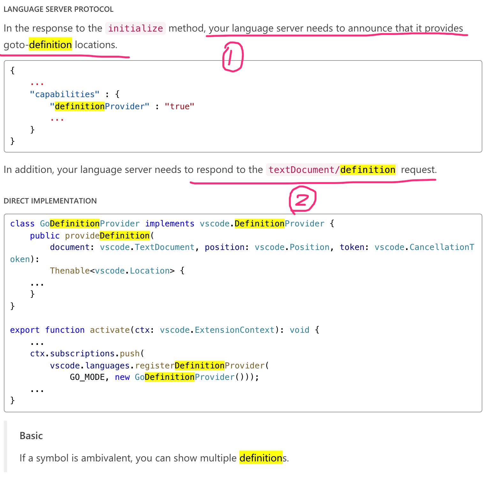
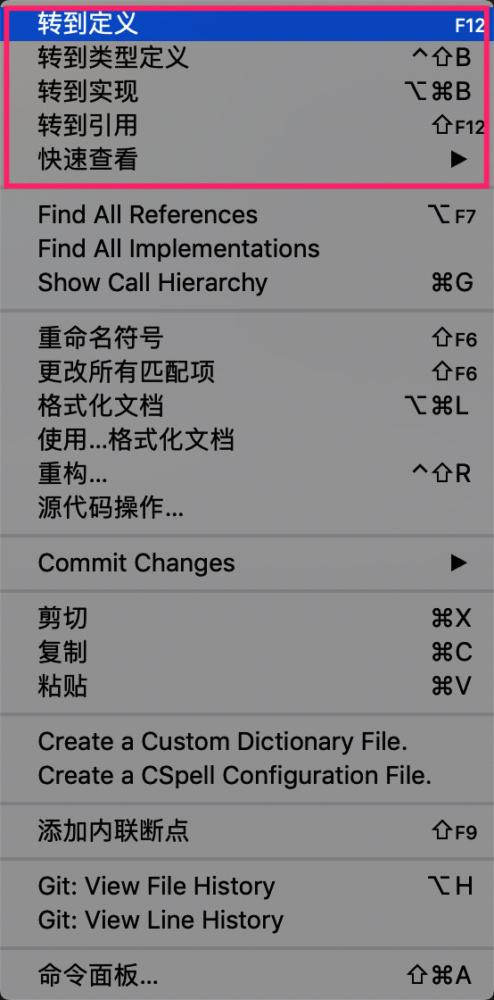
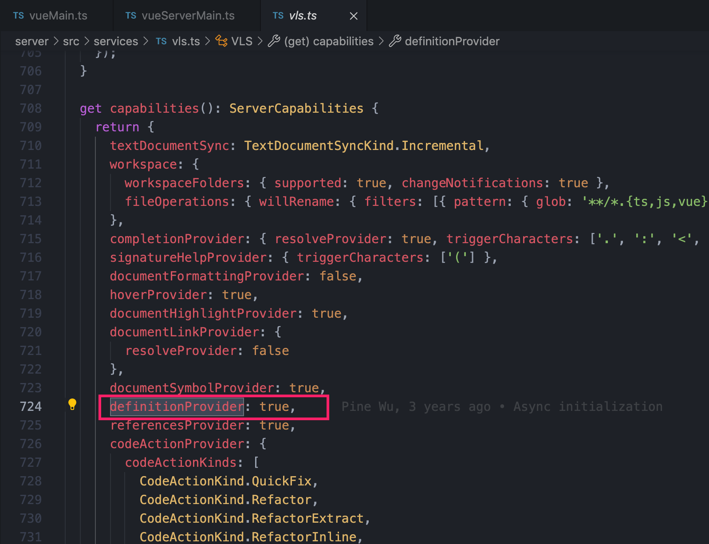
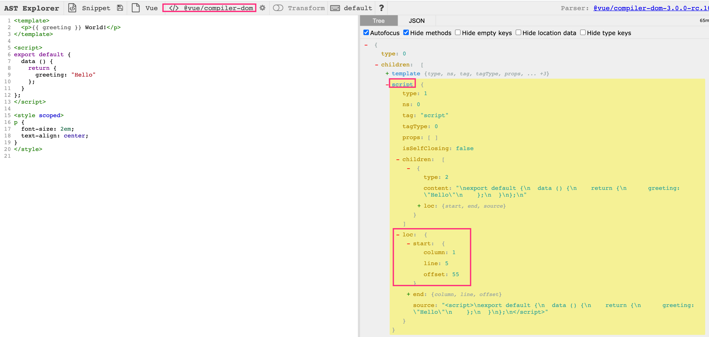
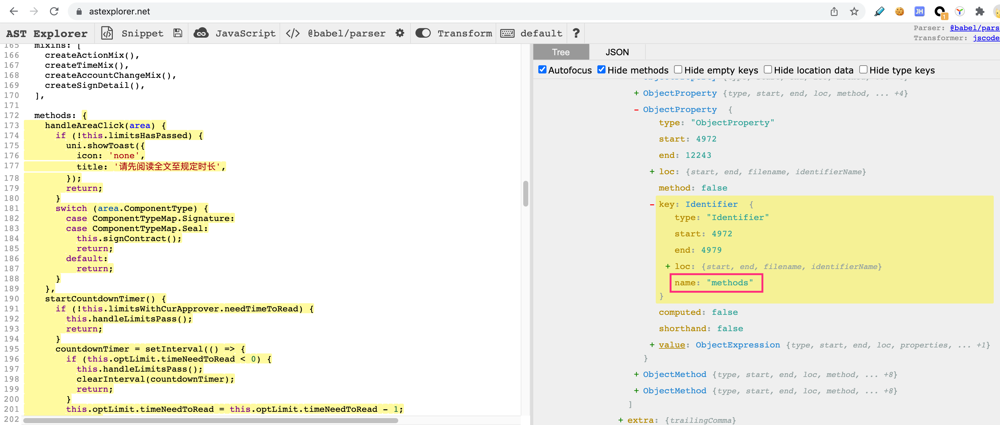
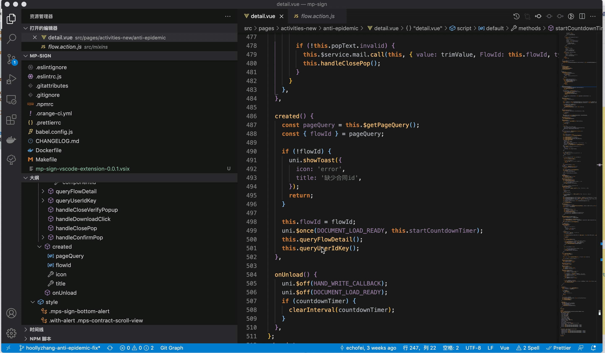
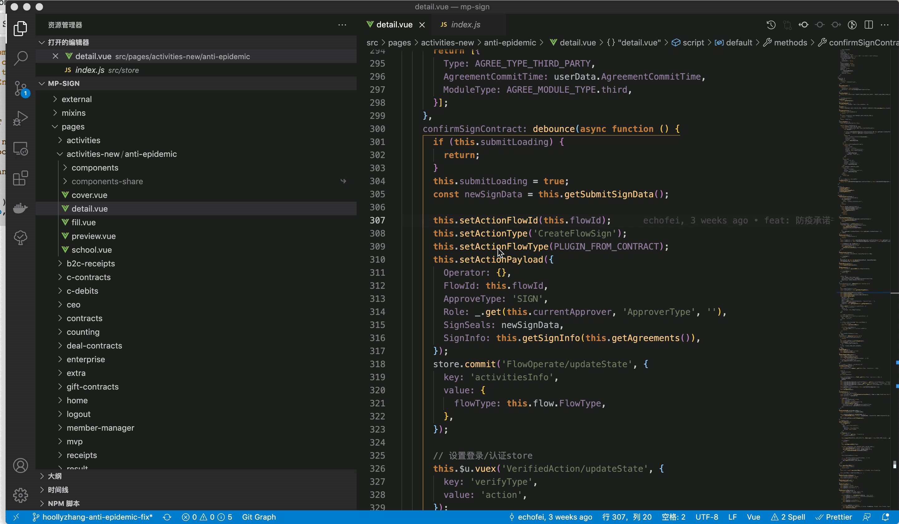
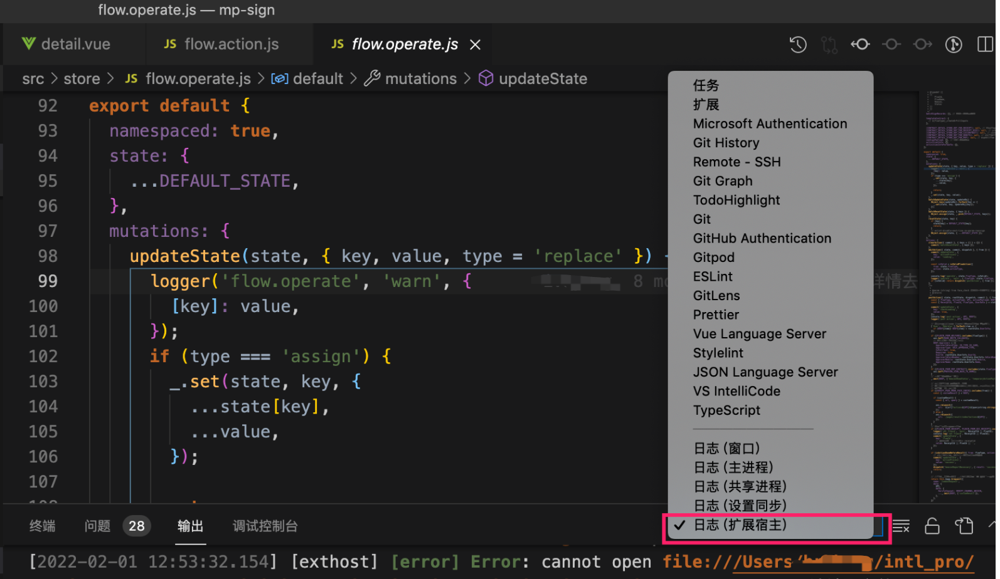

#### 第一步 创建项目

```shell
yo code mp-sign-vscode-extension
```

根据[vscode官网]( https://code.visualstudio.com/api/language-extensions/programmatic-language-features)描述 ，要实现一个GoDefinition的插件，需要做以下两个步骤；



#### 第一步，我们要在语言服务中申明支持 defintionProvider

这样才可以在在插件加载之后出现



转到定义之类的菜单，但我们这里不这么做，因为，根据官网描述，这个只需要被任何一个插件申明一次即可，因为我们的项目mp-sign是一个vue项目，然后大家肯定是安装了[vetur](https://github.com/vuejs/vetur)这个大名鼎鼎的插件的，可以在源码中看到，



上述申明这个插件做过，因此我们可以直接略过这一步；所以我们进入第二步，实现一个`vscode.DefinitionProvider`。


#### 第二步 实现`vscode.DefinitionProvider`

根据官网描述，我们要定义个自定义跳转的插件，需要实现一个  vscode.DefinitionProvider，其原理就是写一个方法实现，定位到源码位置vscode.Location;其原理就是，当我们按住【mac上是command建|windows上是CTRL键】+ 鼠标左键，vscode语言服务就会将当前鼠标位置捕捉到的相关信息传递到给我们这个插件，这些信息丢给vscode.DefinitionProvider 具体实现的 `provideDefinition`这个回调处理。

然后根据我们mp-sign项目的特点，我们主要是解决 mixin和vuex方法定位比较难的问题。同时在实践中发现vue methods块中的方法调用也无法自动跳转，定位代码也挺烦的，因此，直接把三种方式跳转定义全部实现了；

我们要实现的大体框架如下所示。

```typescript
import * as vscode from "vscode";
import * as path from "path";

export default class MpDefinitionProvider implements vscode.DefinitionProvider {
  provideDefinition(
    document: vscode.TextDocument,
    position: vscode.Position,
    token: vscode.CancellationToken
  ): vscode.ProviderResult<vscode.Definition | vscode.LocationLink[]> {
   
    const location:vscode.Location = vueMethods()||mixinMethod()||vuexActionOrMutations()||null
		
    return Promise.resolve(
      location
    );
  }
}

// 是vue的内联方法
function vueMethods() {
  //TODO 
  return new Location()||null;
}
// 是 mixin 方法
function mixinMethod() {
   //TODO
  return new location()||null;
}
// 是 Vuex 的action
function vuexActionOrMutations() {
   //TODO
  return new location()||null;
}

```

注意看看provideDefinition这个方法，他入参有2个比较重要`document vs position`，document有一个属性是uri，这个可以方便我们拿到当前文件的path，position，顾名思义，就是当前鼠标悬停的位置，可以方便我们拿到鼠标悬停的字符串是个啥。

第一个是来处理vueMethods，那么确定目前想要跳转的方法是否是本文件中的methods中的方法，我们需要解析这个vue文件，并且把里面的方法都遍历出来，然后来匹配一下，如果可以匹配到，那说明，改方法就在本文件中对吧。说干就干，解析vue文件搞起，使用 @vue/compiler-dom  的 `parse`方法。



可以看到拿到的结构中children中有三块，template/script/styles，这块内容你可以去[这个网站](https://astexplorer.net/)上看，选择vue就 可以看到，注意一下这里。**每个块中都有一个 loc属性，他的起始位置都有明确的告知，我们这里需要记住一下template文件的end行数**，后面返回vscode.Location时我们需要用到这个偏移量。

通过script模块中的source字段，我们拿到该vue文件中的script块的内容，通过babel 的parse 就可以拿到语法树 AST（一点都不神秘），就可以很方便的找到里面的methods模块中的各个方法了，拿到这些模块，一一匹配，就可以确定方法是否在改文件内的，如果确定在文件内，就可以通过AST返回的loc信息明确这个定义方法在`<script>`块中位置了，主要是行数和列偏移。



上面这幅图可以拿到methods块，即name为methods的ObjectProperty结点，一个find方法轻松找到，同样的道理去找这个结点下面的value中的具体的我们要找的method，所以，第一个实现 vue methods的跳转定位就和么被实现了。

我们先看看实现效果



#### 第三步 继续实现 mixin方法跳转 和 vuex action 跳转

大家都知道在vue中引入mixin之后，代码定位复杂度就加大了，一个主要原因是这个方法不在这个vue文件里面，所以，如何实现呢？

1、经过前面的methods环节的判断，没有找到，就进入了mixin处理块中，这里的逻辑是，找到vue中import的所有的 mixin文件，然后通过babel parse出语法树，按照上面的套路，解析出method的位置，然后生成  vscode.Location返回。

2、同样的道理，vuex action的方式类似，我们这里之定位  this.$u.vuex('Module/action')这类的调用 ，首先通过 document和position两个参数拿到 Module/action ，然后分别解析出 module和action ，module方便我们找到import的是按个文件，action可以通过上述ast解析的方式帮我们定位到具体方法，最后同样返回 vscode.Location。

让我们来看看mixin文件跳转效果以及vuex 之 action 跳转的效果




#### 第四步 打包

`vsce package`

即可，注意node版本要在14以上，不然这个命令会执行失败，另外，如何打包之后发现插件加载失败，可以在这里看日志定位问题



我就碰到过，发现是以为自己安装的npm包babel以及vue解析是放在 devDependencies下的，实际上是需要放到dependencies下面，移动下重新yarn解决。

#### 总结

研发这个插件的目的就是为了解决自己项目中遇到的方法无法跳转到定义的问题，在有这个思路到具体实现出来总共话了2天时间，其中大部分的时间都放在了研究怎么实现一款自定义插件上，主要还是参考官网，期间了解到了不少概念，比如lsp，还被这个坑过，以为实现一个gotoDefinition插件需要做一个服务端，其实后面发现不需要的，官网上其实说的不怎么详细，还是自己从github上参考了别人写的一个gotoDefinition中得出的结论，我这里不下看到8个github上关于插件的实现。

document和position的用法也是从一个项目那里了解到的，具体那个忘记记录了，总之这个不重要了，重要的是，你的目标是什么，要达到这个目标你需要准备些什么知识or工具，做这个插件最大的收获是：

1、学习到了github上几个优秀的插件的实现，顺带也关注了一下几个大佬的博客。

2、知道了vscode gotoDefinition 的原理，后面碰到不能跳转至少知道背后的原因是啥。

3、Google不一定可以帮你解决所有问题，当解决不了的时候，记得github搜索，我就是通过搜索某些api了解到其他人怎么实现的，关于插件研发Google确实能你的有限，学会使用其他渠道。


