因为项目使用的[uni-app](https://github.com/dcloudio/uni-app)来做小程序，所以，不得不去研究下uni-app对小程序打包的整个过程，众所周知，最简单的办法是去github官网去看看他的readme文件，介绍，无奈没发现什么有价值的介绍，只能自己单步调试一下打包的过程了。

### step1、在vscode中配置调试启动配置

在launch.json中添加这一项就ok，这样就可以已调试的方式启动  yarn 命令，我这里是start。

```json
// A launch configuration that compiles the extension and then opens it inside a new window
// Use IntelliSense to learn about possible attributes.
// Hover to view descriptions of existing attributes.
// For more information, visit: https://go.microsoft.com/fwlink/?linkid=830387
{
	"version": "0.2.0",
	"configurations": [
		{
      "type": "node",
      "request": "launch",
      "name": "yarn",
      "runtimeExecutable": "yarn",
      "runtimeArgs": [
        "start"
      ],
      "port": 5858,
      "cwd": "${workspaceRoot}",
      "timeout": 10000
    },
		....
}

```

然后就是启动调试了，当然可以在适当的位置先配置一个断点，比如在这个文件中

`./node_modules/@dcloudio/vue-cli-plugin-uni/lib/env.js`增加一个断点

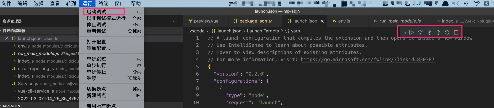

断掉断到之后，可以发现，栈底是在执行这个文件的代码`/internal/main/run_main_module.js`

```javascript
'use strict';

const {
  prepareMainThreadExecution
} = require('internal/bootstrap/pre_execution');

prepareMainThreadExecution(true);

const CJSModule = require('internal/modules/cjs/loader');

markBootstrapComplete();

// Note: this actually tries to run the module as a ESM first if
// --experimental-modules is on.
// TODO(joyeecheung): can we move that logic to here? Note that this
// is an undocumented method available via `require('module').runMain`
CJSModule.runMain();
```

所以，我们发现了一个点，整个构建的开始就是从CJSModule.runMain();这句话开始的。

### step2、分析uni的打包过程中加载了哪些文件

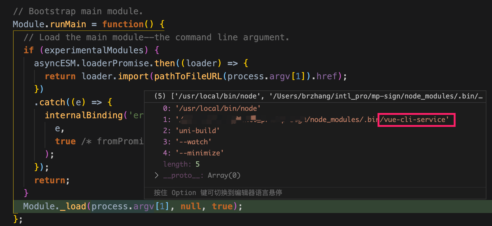

这里应该就是解析参数，准备开始执行yarn命令了，我们看一看我们的yarn命令，

`UNI_PLATFORM=mp-weixin vue-cli-service uni-build --watch`，所以，第一个加载的模块应该就是

@vue/cli-service/bin/vue-cli-service.js

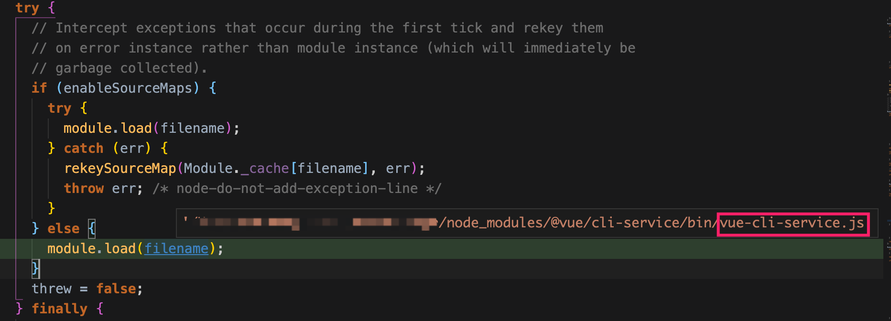

随后的过程记录粗粒度一点点，后面vue-cli-service会加载各种plugin，具体怎么判断是否是一个plugin，有一定的规则命名;

```javascript
const pluginRE = /^(@vue\/|vue-|@[\w-]+(\.)?[\w-]+\/vue-)cli-plugin-/
const scopeRE = /^@[\w-]+(\.)?[\w-]+\//
const officialRE = /^@vue\//

const officialPlugins = [
  'babel',
  'e2e-cypress',
  'e2e-nightwatch',
  'e2e-webdriverio',
  'eslint',
  'pwa',
  'router',
  'typescript',
  'unit-jest',
  'unit-mocha',
  'vuex'
]
exports.isPlugin = id => pluginRE.test(id)
```

然后从项目的package.json的依赖中解析出来了三个需要加载的插件

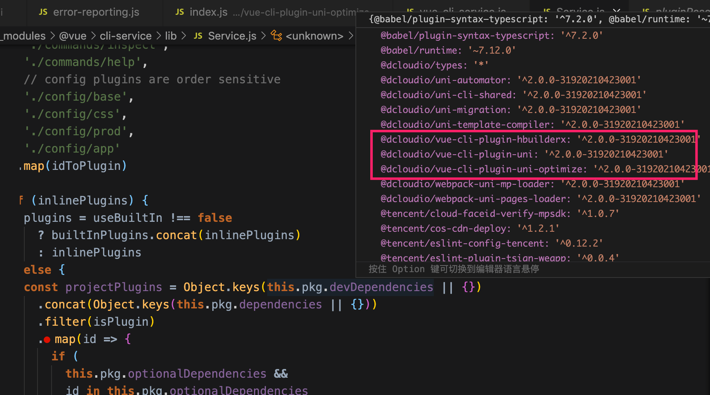

很显然第一个加载并执行的插件就是这个vue-cli-plugin-hbuilderx插件。接着依次去加载其他两个，我们先看第一个插件吧。

#### 加载vue-cli-plugin-uni插件

进入一看，他直接退出了，原因是只处理 app-plus相关的逻辑，而我们编译的是mp-weixin

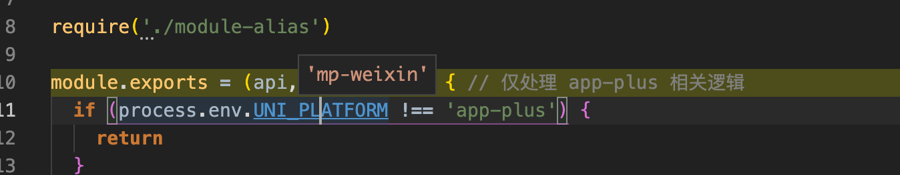

所以，忽略，直接进入下面一个 vue-cli-plugin-uni的加载，这个文件先加载了一个.env.js

```javascript
// 初始化全局插件对象
global.uniPlugin = require('@dcloudio/uni-cli-shared/lib/plugin').init()
```

这个里面就初始化了全局插件对象，然后它的init操作中去加载了对应平台的插件，也就是说，编译什么平台就加载什么平台的插件。

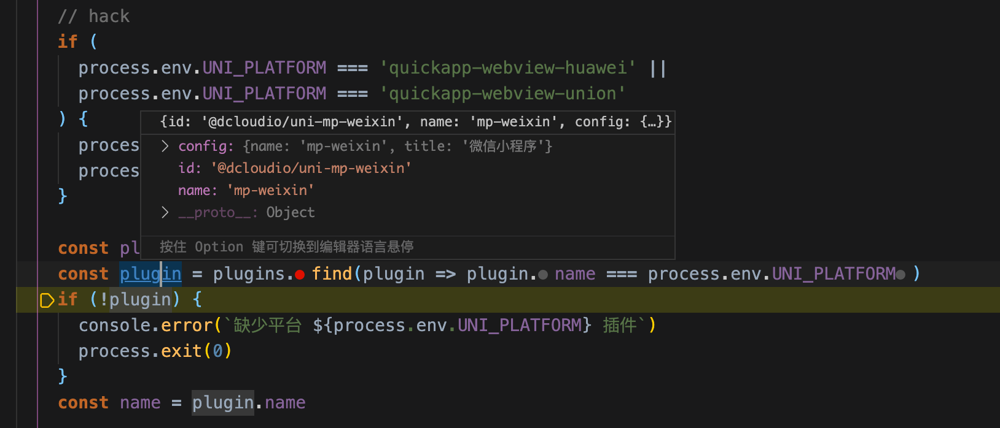

我们编译的是小程序的，所以加载的是@dcloudio/uni-mp-weixin。

这里在外后走就是初始化预处理器，**然后发现Plugin.platforms中居然有一个h5，暂时不知道为什么编译小程序平台需要h5，难道h5是必须的嘛**？这个问题先放一放

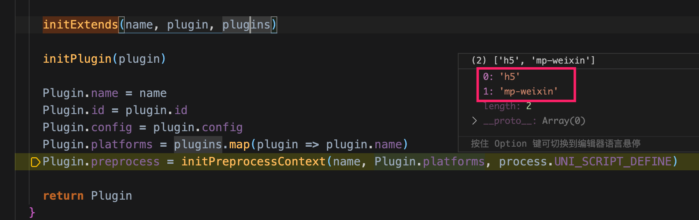

知道env.js执行完，就可以知道，他做了一下几件事情：

1. 初始化了全局插件，读取了一些webpack配置，特别是copyWebpackOptions
2. 以及一些全局的options，如cssVars，extNames，subPackages等
   1. 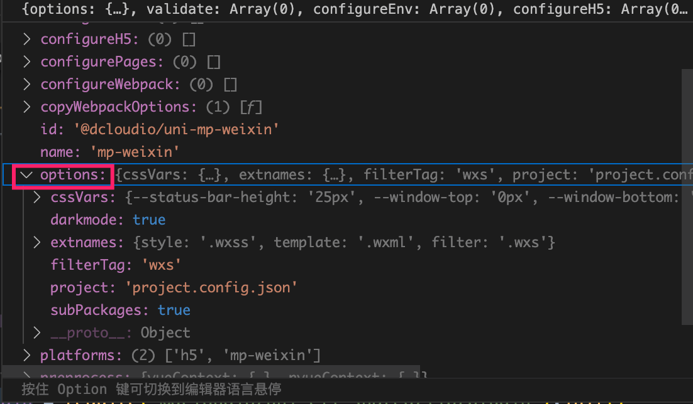
3. 设置了一堆的环境变量
   1. process.env.UNI_PLATFORM
   2. process.env.VUE_APP_PLATFORM
   3. process.env.UNI_OUTPUT_DIR
4. 确定了build后产物的路径process.env.UNI_OUTPUT_DIR
5. 对分包subPackages的处理
6. process.env.VUE_APP_DEBUG 开关
7. 增加了一堆的hack操作，把vue相关的库指向了uni自己的包装过的
   1. 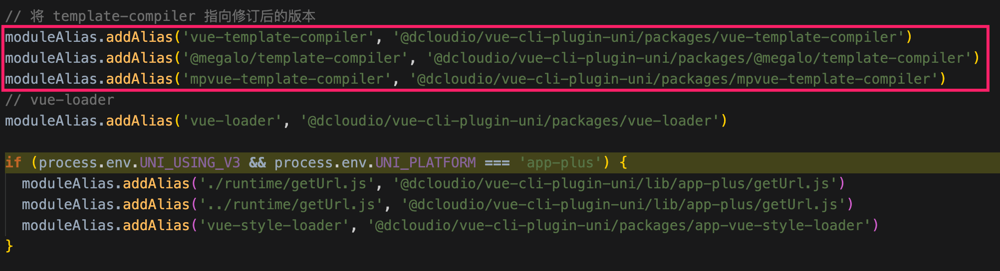

插件加载之后，下一步 就是要执行插件，执行操作设计到对vue代码转换为小程序语法的过程，这部分内容，我觉得还是单独开一篇比较合适。

#### 加载vue-cli-plugin-uni-optimize插件

这个插件主要是做了一些代码优化，代码也不是很多，很直观就可以看明白

```javascript
const path = require('path')

const webpack = require('webpack')

const WebpackOptimizePlugin = require('./packages/webpack-optimize-plugin')

const {
  src,
  lib
} = require('@dcloudio/uni-h5/path')

const resolve = dir => path.resolve(__dirname, './', dir)

module.exports = (api, options) => {
  if (!process.env.UNI_OPT_TREESHAKINGNG) {
    return
  }

  if (process.env.NODE_ENV !== 'production' || process.env.UNI_PLATFORM !== 'h5') {
    return
  }

  // 组件
  const uniComponentsPath = resolve('.tmp/components.js')

  const uniInvokeApiPath = resolve('.tmp/invoke-api.js')
  const uniServiceApiPath = resolve('.tmp/api.js')
  const uniApiProtocolPath = resolve('.tmp/protocol.js')
  const uniApiSubscribePath = resolve('.tmp/subscribe.js')
  const uniH5AppComponentsPath = resolve('.tmp/app-components.js')
  const uniH5AppMixinsPath = resolve('.tmp/app-mixins.js')
  const uniH5SystemRoutes = resolve('.tmp/system-routes.js')

  options.transpileDependencies.push(/vue-cli-plugin-uni-optimize/)
  options.transpileDependencies.push(/uni-h5/)

  api.configureWebpack(webpackConfig => {
    return {
      watch: true,
      resolve: {
        alias: {
          ['uni-' + process.env.UNI_PLATFORM]: path.join(lib, `${process.env.UNI_PLATFORM}/main.js`),
          'uni-core': path.join(src, 'core'),
          'uni-view': path.join(src, 'core/view'),
          'uni-service': path.join(src, 'core/service'),
          'uni-shared': path.join(src, 'shared'),
          'uni-mixins': path.join(src, 'core/view/mixins'),
          'uni-helpers': path.join(src, 'core/helpers'),
          'uni-platform': path.join(src, 'platforms/' + process.env.UNI_PLATFORM),

          // tree shaking
          'uni-components': uniComponentsPath,
          'uni-invoke-api': uniInvokeApiPath,
          'uni-service-api': uniServiceApiPath,
          'uni-api-protocol': uniApiProtocolPath,
          'uni-api-subscribe': uniApiSubscribePath,
          // h5 components
          'uni-h5-app-components': uniH5AppComponentsPath,
          'uni-h5-app-mixins': uniH5AppMixinsPath,
          'uni-h5-system-routes': uniH5SystemRoutes
        }
      },
      plugins: [
        new WebpackOptimizePlugin(),
        new webpack.DefinePlugin({
          __VERSION__: JSON.stringify(require('@dcloudio/uni-' + process.env.UNI_PLATFORM + '/package.json').version),
          __PLATFORM__: JSON.stringify(process.env.UNI_PLATFORM)
        }),
        new webpack.ProvidePlugin({
          console: [path.join(src, 'core/helpers/console'), 'default'],
          UniViewJSBridge: [path.join(src, 'core/view/bridge/index')],
          UniServiceJSBridge: [path.join(src, 'core/service/bridge/index')]
        })
      ]
    }
  })

  api.chainWebpack(webpackConfig => {
    // Vue
    webpackConfig.module
      .rule('vue')
      .use('vue-loader')
      .tap(options => Object.assign(options, {
        isH5TreeShaking: true,
        cacheDirectory: false,
        cacheIdentifier: false
      }))
      .end()
      .uses
      .delete('cache-loader')
  })
}

```

从这里也了解了，为啥编译一个小程序还需要h5的插件,然来是vue-cli-plugin-uni-optimize这个插件需要基于h5

```javascript
const {
  src,
  lib
} = require('@dcloudio/uni-h5/path')
```

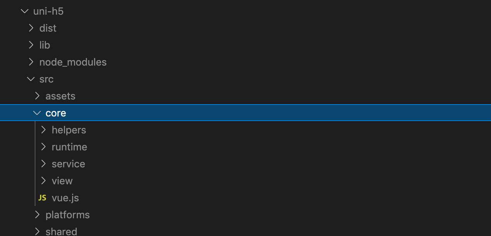

用到了他里面的一些核心能力，这也从侧面了解，uni编译各种版本，基本上都会最终依赖上这个h5的插件。这里也可以了解到，如果是开发模式，这个插件不会被执行，因为

```javascript
if (!process.env.UNI_OPT_TREESHAKINGNG) {
    return
}
```


### step3、执行插件

通常一个插件都会暴露出一个方法

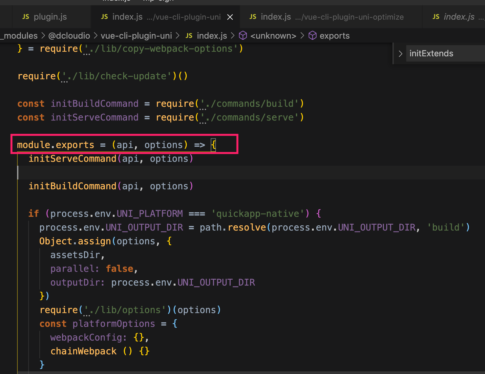

这个方法，将会被vue-cli-service去挨个挨个执行

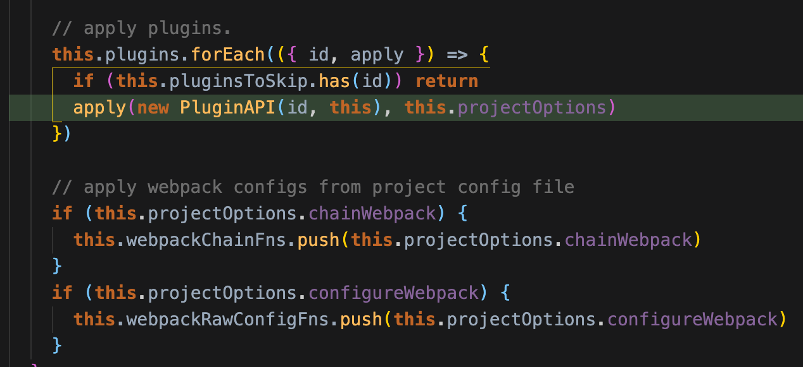

插件被执行完之后，最终就会进入到构建环节

### step3、进入构建环节

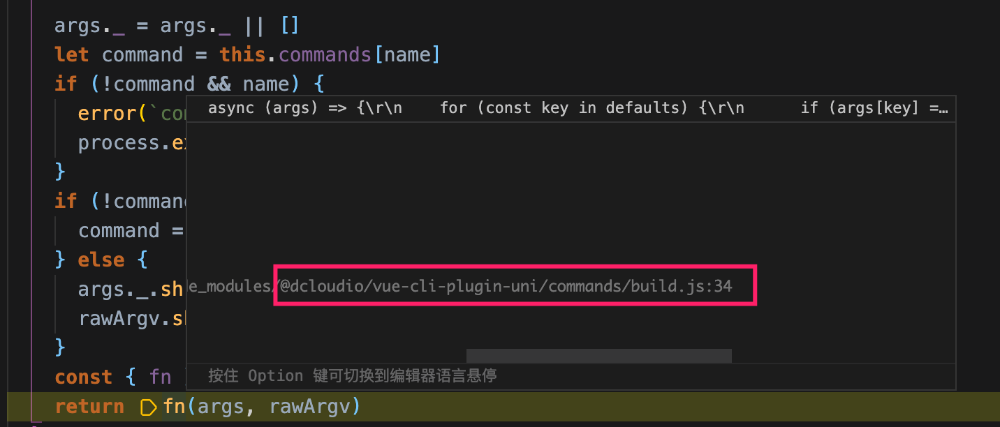

这里就不直接展开了，小程序产物构建完全可以单独搞一章了。

这里我们了解整个过程之后，发现uni打开做了这么几件事

1. 使用yarn start命令，会直接出发vue-cli-service活动起来，然后开始加载vue-cli相关的插件
2. 其中uni的三个插件会被加载，并依次之心
3. 同时我们发现，在小程序模式下，hbuilderx插件是不会被执行的
4. 然后我们发现optimize插件在develop模式下是不会被执行的
5. 因此我们发现只有vue-cli-plugin-uni这个插件会被执行，这里面做了一些列的准备工作，目的就是为了uni能够有一个编译为小程序的环境，他在执行完插件体之后，最终cli-service会转而调用@dcloudio/vue-cli-plugin-uni/commands/build.js中的build方法，然后build方法在执行的过程中，会到@dcloudio/vue-cli-plugin-uni/lib/mp/index.js中执行去手机webpack的一些配置，汇总好继续build的构建。

**下面附上这些个过程的堆栈信息，其调用过程一目了然。**

> webpackConfig (/Users/xxx/mp-project/node_modules/**@dcloudio/vue-cli-plugin-uni/lib/mp/index.js**:149)
> ....**此处省略一些堆栈**
> build (/Users/xxx/mp-project/node_modules/@dcloudio/vue-cli-plugin-uni/commands/build.js:137)
> <anonymous> (/Users/xxx/mp-project/node_modules/**@dcloudio/vue-cli-plugin-uni/commands/build.js:62**)
> run (/Users/xxx/mp-project/node_modules/@vue/cli-service/lib/**Service.js:230**)
> <anonymous> (/Users/xxx/mp-project/node_modules/@vue/cli-service/bin/**vue-cli-service.js:36**)
> Module._compile (<node_internals>/internal/modules/cjs/loader.js:956)
> Module._extensions..js (<node_internals>/internal/modules/cjs/loader.js:973)
> Module.load (<node_internals>/internal/modules/cjs/loader.js:812)
> Module._load (<node_internals>/internal/modules/cjs/loader.js:724)
> Module.runMain (<node_internals>/internal/modules/cjs/**loader.js:1025**)
> <anonymous> (<node_internals>/internal/main/**run_main_module.js:17**)


这里也贴一下vue-cli-plugin-uni/lib/mp/index.js的核心代码，后续的文章就了解这个里面怎么把vue代码构建成小程序的。

```javascript
module.exports = {
  vueConfig: {
    parallel: false
  },
  webpackConfig (webpackConfig, vueOptions, api) {
    if (!webpackConfig.optimization) {
      webpackConfig.optimization = {}
    }
    // disable noEmitOnErrors
    webpackConfig.optimization.noEmitOnErrors = false

    webpackConfig.optimization.runtimeChunk = {
      name: 'common/runtime'
    }

    webpackConfig.optimization.splitChunks = require('../split-chunks')()

    parseEntry()

    const statCode = process.env.UNI_USING_STAT ? 'import \'@dcloudio/uni-stat\';' : ''

    let beforeCode = 'import \'uni-pages\';'

    const plugins = [
      new WebpackUniAppPlugin(),
      createUniMPPlugin(),
      new webpack.ProvidePlugin(getProvides())
    ]

    if ((process.env.UNI_SUBPACKGE || process.env.UNI_MP_PLUGIN) && process.env.UNI_SUBPACKGE !== 'main') {
      plugins.push(new PreprocessAssetsPlugin())
    }

    if (process.env.UNI_MP_PLUGIN) {
      // 小程序插件入口使用
      // packages\webpack-uni-mp-loader\lib\plugin\index-new.js -> addMPPluginRequire
      beforeCode += `wx.__webpack_require_${process.env.UNI_MP_PLUGIN.replace('-', '_')}__ = __webpack_require__;`

      const UNI_MP_PLUGIN_MAIN = process.env.UNI_MP_PLUGIN_MAIN
      if (UNI_MP_PLUGIN_MAIN) {
        process.UNI_ENTRY[UNI_MP_PLUGIN_MAIN.split('.')[0]] = path.resolve(process.env.UNI_INPUT_DIR, UNI_MP_PLUGIN_MAIN)
      }
    }

    return {
      mode: process.env.NODE_ENV === 'production' ? 'production' : 'development',
      entry () {
        return process.UNI_ENTRY
      },
      output: {
        filename: '[name].js',
        chunkFilename: '[id].js',
        globalObject: process.env.UNI_PLATFORM === 'mp-alipay' ? 'my' : 'global'
        // sourceMapFilename: '../.sourcemap/' + process.env.UNI_PLATFORM + '/[name].js.map'
      },
      performance: {
        hints: false
      },
      resolve: {
        extensions: ['.nvue'],
        alias: { // 仅 mp-weixin
          'mpvue-page-factory': require.resolve(
            '@dcloudio/vue-cli-plugin-uni/packages/mpvue-page-factory')
        }
      },
      module: {
        rules: [{
          test: path.resolve(process.env.UNI_INPUT_DIR, getMainEntry()),
          use: [{
            loader: path.resolve(__dirname, '../../packages/wrap-loader'),
            options: {
              before: [
                beforeCode + require('../util').getAutomatorCode() + statCode
              ]
            }
          }, {
            loader: '@dcloudio/webpack-uni-mp-loader/lib/main'
          }]
        }, {
          resourceQuery: /vue&type=script/,
          use: [{
            loader: '@dcloudio/webpack-uni-mp-loader/lib/script'
          }]
        }, {
          resourceQuery: /vue&type=template/,
          use: [{
            loader: '@dcloudio/webpack-uni-mp-loader/lib/template'
          }, {
            loader: '@dcloudio/vue-cli-plugin-uni/packages/webpack-uni-app-loader/page-meta'
          }]
        }, createTemplateCacheLoader(api), {
          resourceQuery: [
            /lang=wxs/,
            /lang=filter/,
            /lang=sjs/,
            /blockType=wxs/,
            /blockType=filter/,
            /blockType=sjs/
          ],
          use: [{
            loader: require.resolve(
              '@dcloudio/vue-cli-plugin-uni/packages/webpack-uni-filter-loader')
          }]
        }]
      },
      plugins
    }
  },
  chainWebpack (webpackConfig, vueOptions, api) {
    if (process.env.UNI_PLATFORM === 'mp-baidu') {
      webpackConfig.module
        .rule('js')
        .exclude
        .add(/\.filter\.js$/)
    }

    const compilerOptions = process.env.UNI_USING_COMPONENTS ? {} : require('../mp-compiler-options')

    modifyVueLoader(webpackConfig, {}, compilerOptions, api)

    const styleExt = getPlatformExts().style

    webpackConfig.plugin('extract-css')
      .init((Plugin, args) => new Plugin({
        filename: '[name]' + styleExt
      }))

    if (
      process.env.NODE_ENV === 'production' &&
      process.env.UNI_PLATFORM !== 'app-plus'
    ) {
      const OptimizeCssnanoPlugin = require('../../packages/@intervolga/optimize-cssnano-plugin/index.js')
      webpackConfig.plugin('optimize-css')
        .init((Plugin, args) => new OptimizeCssnanoPlugin({
          sourceMap: false,
          filter (assetName) {
            return path.extname(assetName) === styleExt
          },
          cssnanoOptions: {
            preset: [
              'default',
              Object.assign({}, getPlatformCssnano(), {
                discardComments: true
              })
            ]
          }

        }))
    }

    if (process.env.UNI_SUBPACKGE || process.env.UNI_MP_PLUGIN) {
      initSubpackageConfig(webpackConfig, vueOptions)
    }

    webpackConfig.plugins.delete('hmr')
    webpackConfig.plugins.delete('html')
    webpackConfig.plugins.delete('copy')
    webpackConfig.plugins.delete('preload')
    webpackConfig.plugins.delete('prefetch')
  }
}

```

最后配置汇总之后，还要验证下是否合法

```javascript
 // check for common config errors
  validateWebpackConfig(webpackConfig, api, options, args.target)
```

合法就开始使用webpack打包咯

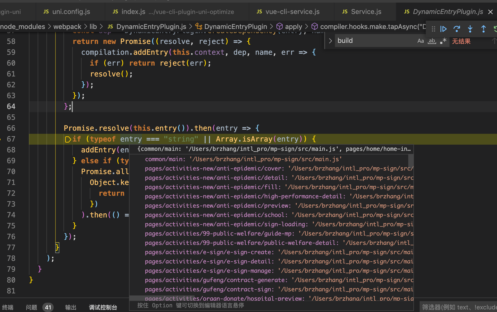

```javascript

```

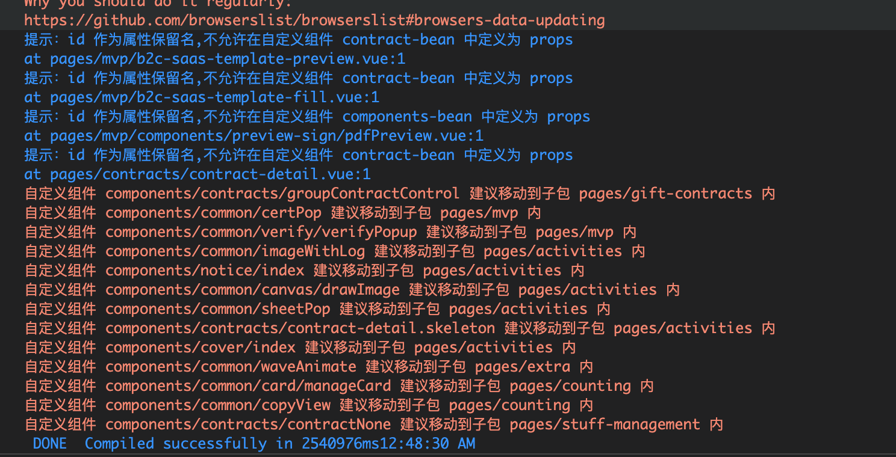