最近想换回自己的iphone7玩一玩，充满电，看下电池的最大容量居然只有79%，

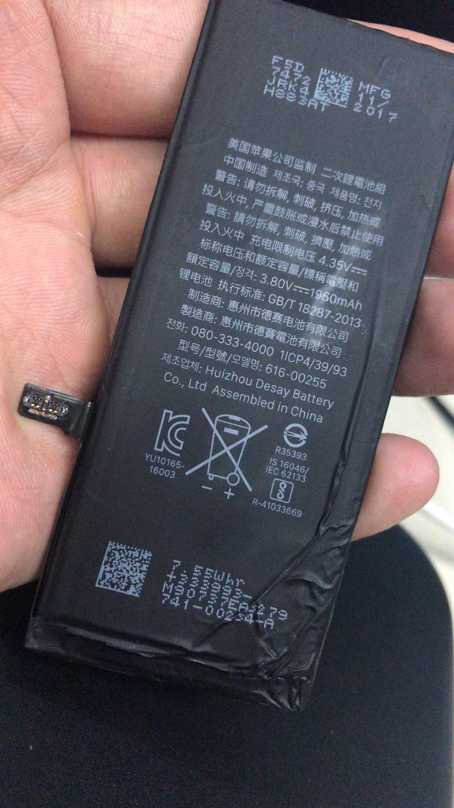

这你也能忍？果断在某多多上买了一个电池；

### 电池哪家强

只看了两家 品胜 和remax，对比了下发现最大容量差不多，发现品胜的差评比较多：

1. 做工不像品胜的，怀疑某些商家以次充好
2. 发现还不如以前的原装电池，掉电像跑表似的

基于以上两点，本来想买品胜的我果断选择了remax，

remax的稍微便宜10来块钱，差评还挺少见的。

#### 如何拆下老电池

电池到手之后，看到包裹里面放了一个二维码，打开是这个[这个视频](https://www.iqiyi.com/v_18ahk2godsw.html?weixin_platform=friend)，这里详细的介绍了如何拆下老电池的方法，大概来说分为7步：

1. 将充电口那里的2个啰嗦下下来，注意，最好用一片卫生纸把螺丝都搜集在一起，不然很容易丢失。
   1. 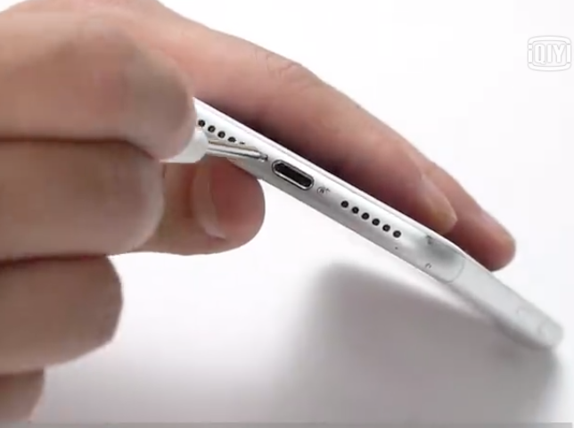
2. 使用吸盘吸屏幕，顺便用塑料翘片把机身撬开，注意，先从充电口这边开始撬，然后顺着左右两边，分别撬到电源键，和声音键为止，基本上就可以打开盖子了
   1. 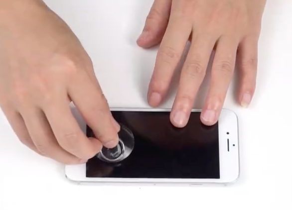
   2. 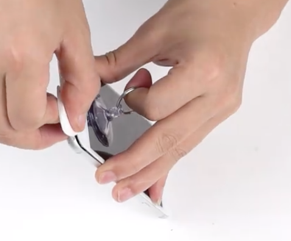
3. 打开盖子这部一定要注意，只能是由声音键的这边揭开屏幕，因为排线在电源键那边，那个很容易段开毁掉，所以，这部得千万注意，然后揭开的盖子最好不要超过 90度，实际测试110也问题不到，但是180度的话，果断排线会被你毁掉，所以，最好是用基本上靠着。
   1. 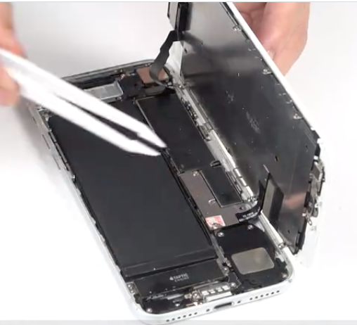
4. 使用螺丝刀拧开电池接线头的盖子，这部没啥风险，就是拧啰嗦，注意点在于，这个螺丝很小，小心别丢了，另外，有一个螺丝设计有点古怪，可能因为电池接线头铁盖子和螺纹口距离有点远，它是先用了一个大的螺丝点地下一层，再在螺丝上上一个螺丝。
   1. 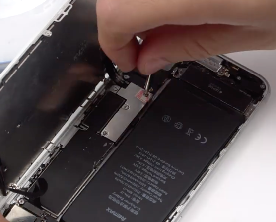
   2. 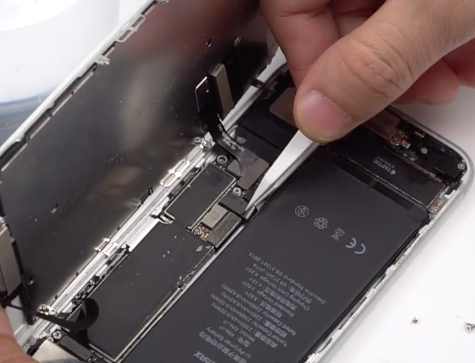
5. 撬开电池接线和主板接口，轻轻用力就可以撬开了。
6. 把电池和手机盖子的粘胶扯下来，注意用力别太大，很容扯断，我就扯断了，不过没关系，把电子撬开点，用镊子拉出来继续往外扯。2个粘胶都扯下来后原装电池就自然很容易拿出来了。
   1. 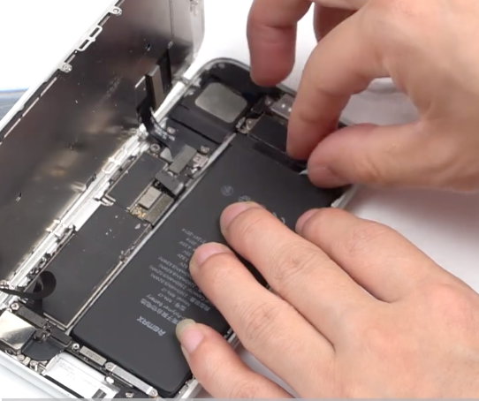
   2. 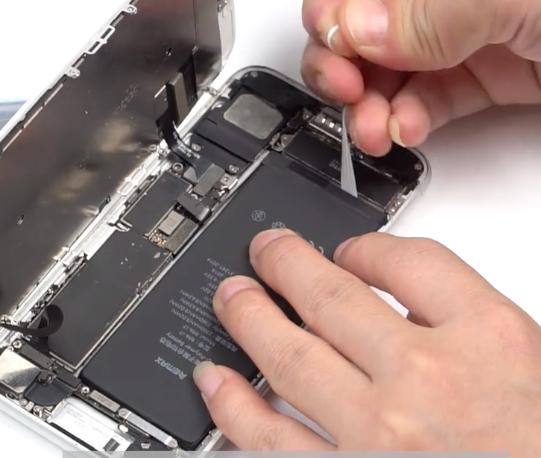
7. 换上新买的电池来试试吧，接线和主板接好就尝试开机，不要急着把粘胶贴上了，如果可以开机，看看电池容量是否是100，如果是，就没问题了，就可以开始最后一步了。
   1. 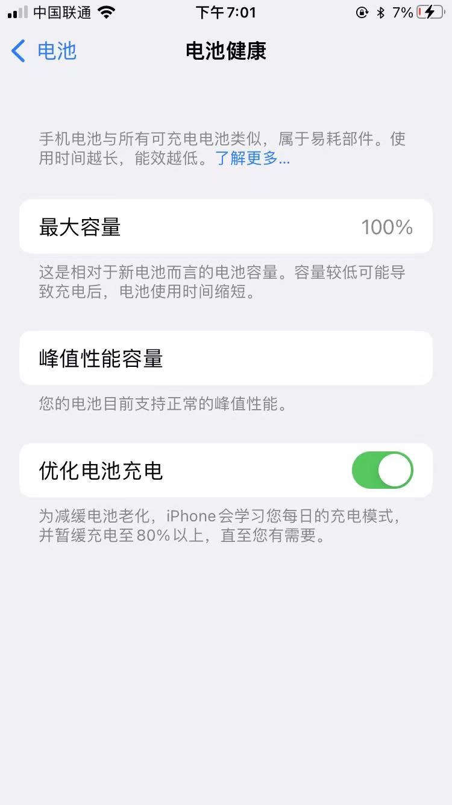
8. 这时候可以贴粘胶，沾到手机盖子上，注意粘胶别贴反了，这个是要放在背面和手机金属盖贴在一起的。然后改上贴片，盖上手机，上号螺丝，大功告成。
   1. 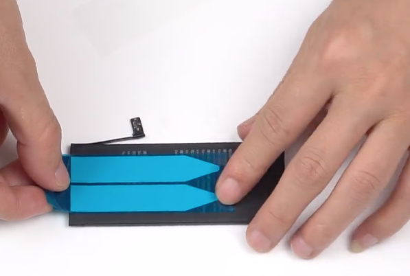