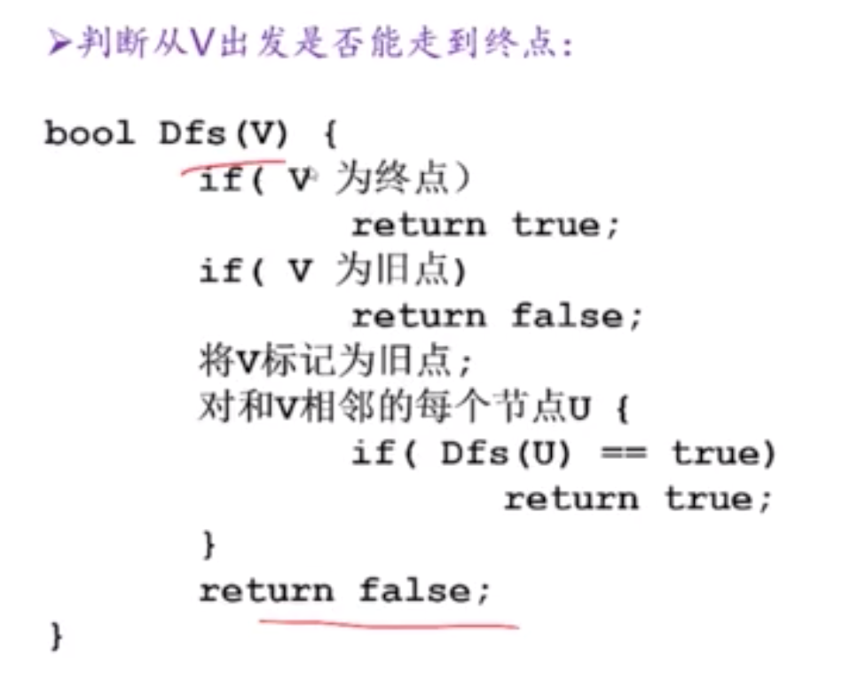

#### 递归

把规模为 N 的问题变成规模为 N-1 的问题，需要注意**边界条件**，所谓的边界条件就是指遇到这种情况可以直接得出结论，有了边界条件就可以避免无穷递归。

1. 最常使用在树的遍历
2. 文件的遍历

最重要的思想是**问题分解**思想；

> 比如，青蛙上台阶问题，话说这个青蛙可以每次跳 1 步，或者每次跳 2 步，请问他跳到第 N 阶台阶需要多少步。

这就是一个典型的可以用递归法去解决的问题，

1. 递推方程：f(n) = f(n-1) + f(n-2)
2. 递推终止条件： f(1)=1,f(2)=2

#### 动归

可以理解为递归的升级版本，需要抽象出最优子结构和无后效性。

常用大框架解法

1. 查表法：递归+表查询
2. 人人为我，递推

最经典的问题是最长公共子序列，动态规划没有固定的解法，具体问题具体分析：

1. 怎么设计这个状态
2. 状态的转移

##### 那样的题目可以使用动态规划方式解决

1. **问题具有最优子结构性质**。如果问题的最优解所包含的 子问题的解也是最优的，我们就称该问题具有最优子结 构性质。
2. **无后效性**。当前的若干个状态值一旦确定，则此后过程 的演变就只和这若干个状态的值有关，和之前是采取哪 种手段或经过哪条路径演变到当前的这若干个状态，没有关系。
   1. 坑点，最长递增子序列，这种子问题的结构的分解。

> 递归到动规的一般转化方法

递归函数有 n 个参数，就定义一个 n 维的数组，数组 的下标是递归函数参数的取值范围，数组元素的值 是递归函数的返回值，这样就可以从边界值开始， 逐步填充数组，相当于计算递归函数值的逆过程。

> 动规解题的一般思路

1. ##### 将原问题分解为子问题

   1. 把原问题分解为若干个子问题，子问题和原问题形式相同或类似，只不过规模变小了。子问题都解决，原问题即解决(数字三角形例）。
   2. 子问题的解一旦求出就会被保存，所以每个子问题只需求解一次(查表法，但是需要定义一个大的数组)。

2. ##### 确定状态

   1. 在用动态规划解题时，我们往往将和子问题相 关的**各个变量的一组取值**，称之为一个“**状态**”。一个“状态”对应于一个或多个子问题， 所谓某个“状态”下的“值”，就是这个“状 态”所对应的子问题的解

3. ##### 确定一些初始状态（边界状态）的值

   1. 以“数字三角形”为例，初始状态就是底边数字，值 就是底边数字值。
   2. 以最长公共子序列来说，初始状态就是全 0，然后一行一行的递推下去。

4. ##### 确定状态转移方程

   1. 定义出什么是“状态”，以及在该 “状态”下的“值”后，就要 找出不同的状态之间如何迁移――即如何从一个或多个“值”已知的 “状态”，求出另一个“状态”的“值”(“人人为我”递推型)。状 态的迁移可以用递推公式表示，此递推公式也可被称作“状态转移方 程”。

#### 深搜

