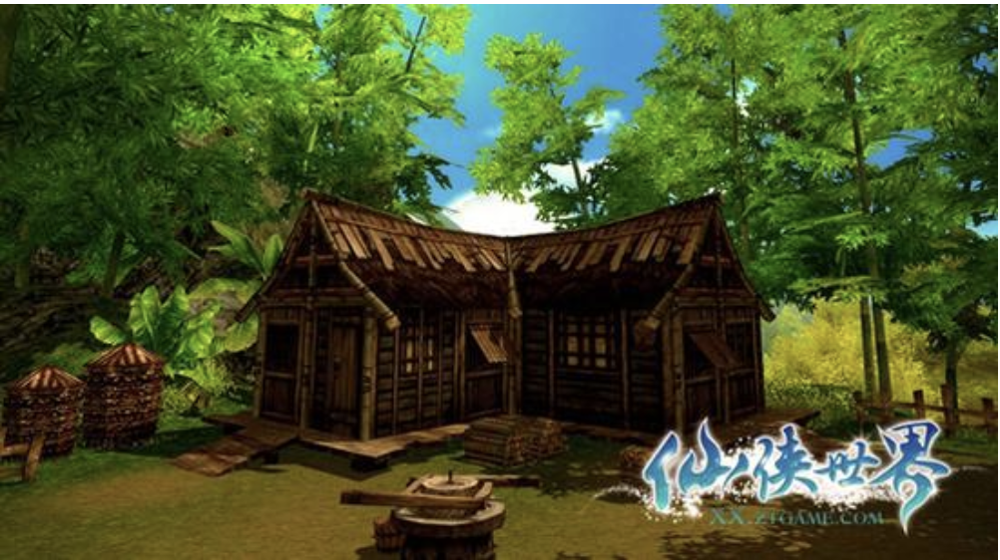

小桥流水人家，也许是大多数人所向往的退休后的生活；

1. 依山傍水渺无人烟，远离城市的喧嚣，这里有清澈的流水，清晰的空气。
   1. 
2. 一个不大不小的宅院，小二层的别样阁楼，最好是有一个合适的院子，里面可以放上一些基础的设施：
   1. 邀请朋友来做客，沏一壶上好的龙井，几人围坐在石桌旁，品味人生
   2. 累了，就在秋千上躺平，摇摇晃晃如婴儿般入睡
   3. 醒来，去私人的听歌房闭幕欣赏半个小时的音乐，然后去书房与古人来一场灵魂的对话
